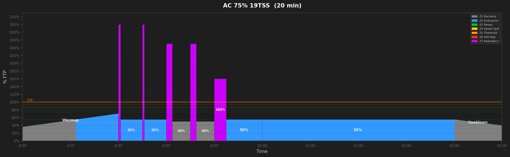
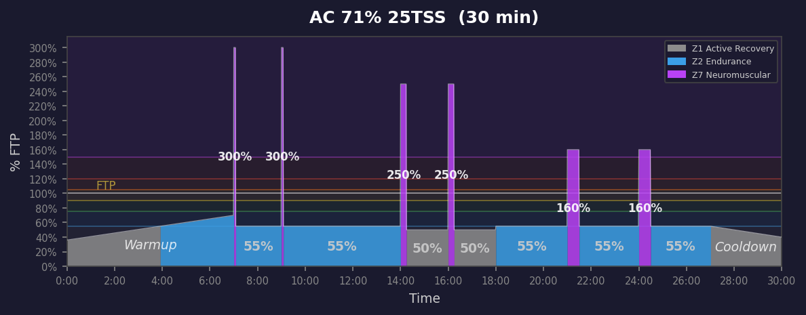
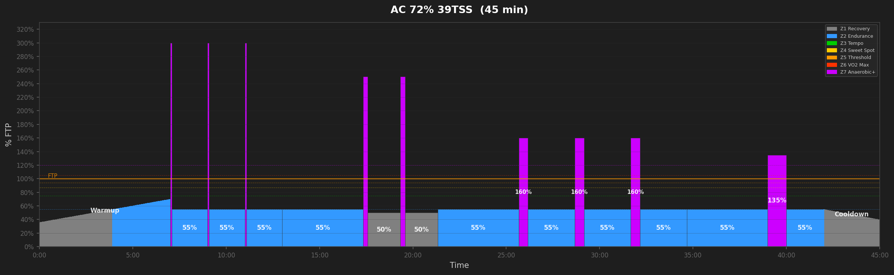
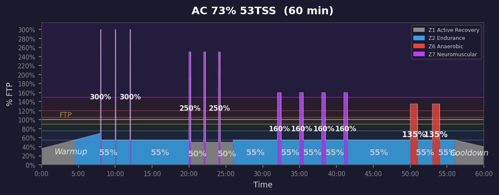
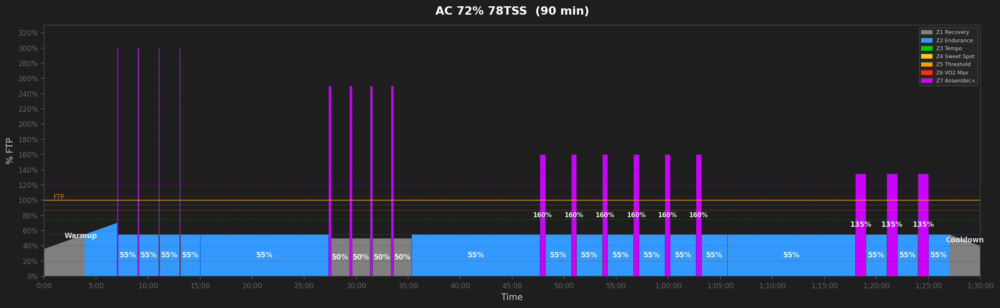
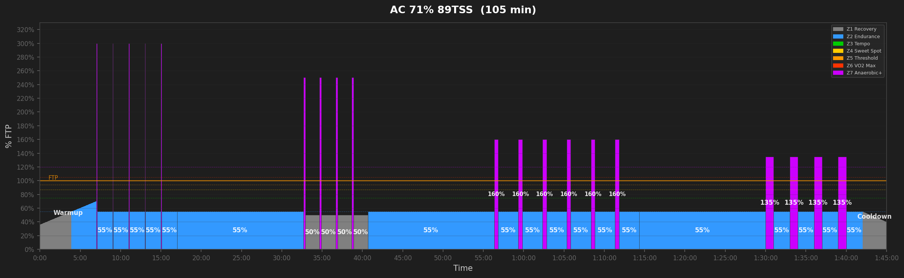
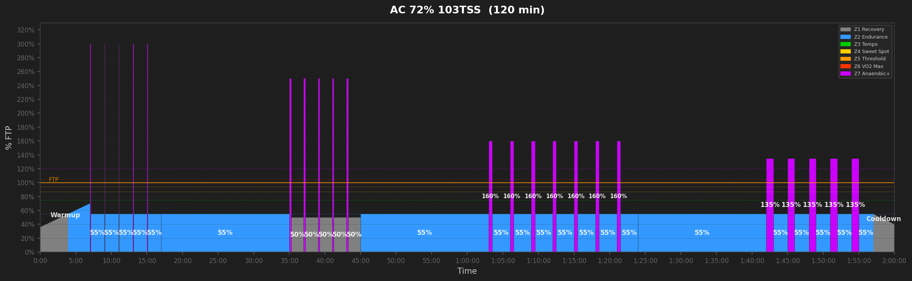

# Anaerobic Workouts

## AC 75% 19TSS  (20 min)

_20min sprint ladder: 2x5s + 2x15s + 1x30s. Targets sprint durations 5-30s._

---

## AC 71% 25TSS  (30 min)

_30min full sprint ladder: 2x5s + 2x15s + 2x30s. Targets ALL sprint durations 5-60s with recovery valleys._

---

## AC 72% 39TSS  (45 min)

_45min full sprint ladder: 3x5s + 2x15s + 3x30s + 1x60s. Targets ALL sprint durations 5-60s with recovery valleys._

---

## AC 73% 53TSS  (60 min)

_60min full sprint ladder: 3x5s + 3x15s + 4x30s + 2x60s. Targets ALL sprint durations 5-60s with recovery valleys._

---

## AC 73% 66TSS  (75 min)

_75min full sprint ladder: 4x5s + 3x15s + 5x30s + 3x60s. Targets ALL sprint durations 5-60s with recovery valleys._

---

## AC 72% 78TSS  (90 min)

_90min full sprint ladder: 4x5s + 4x15s + 6x30s + 3x60s. Targets ALL sprint durations 5-60s with recovery valleys._

---

## AC 71% 89TSS  (105 min)

_105min full sprint ladder: 5x5s + 4x15s + 6x30s + 4x60s. Targets ALL sprint durations 5-60s with recovery valleys._

---

## AC 72% 103TSS  (120 min)

_120min full sprint ladder: 5x5s + 5x15s + 7x30s + 5x60s. Targets ALL sprint durations 5-60s with recovery valleys._

---
