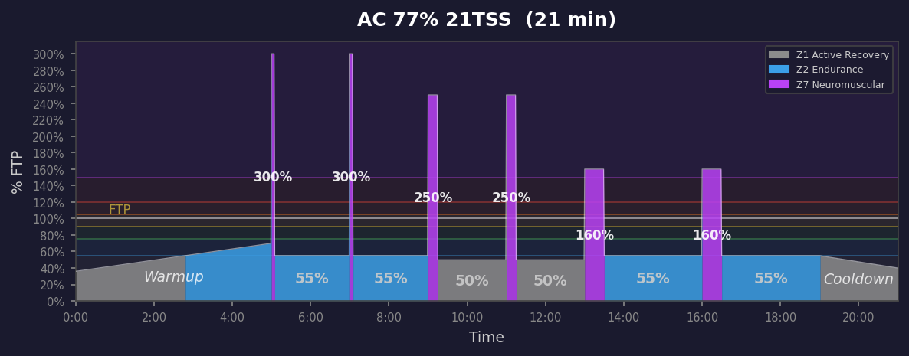
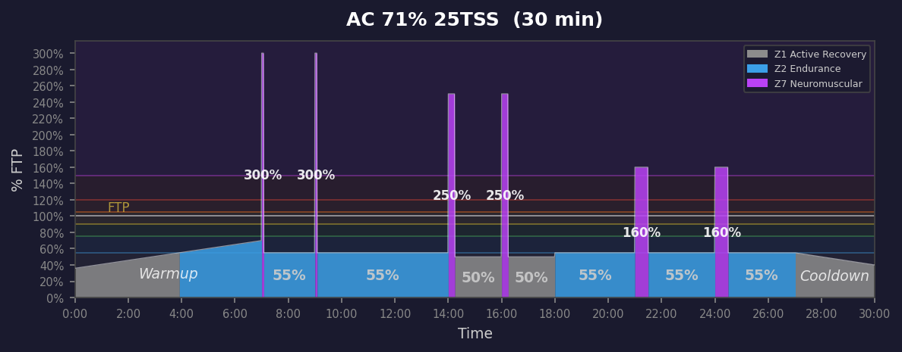
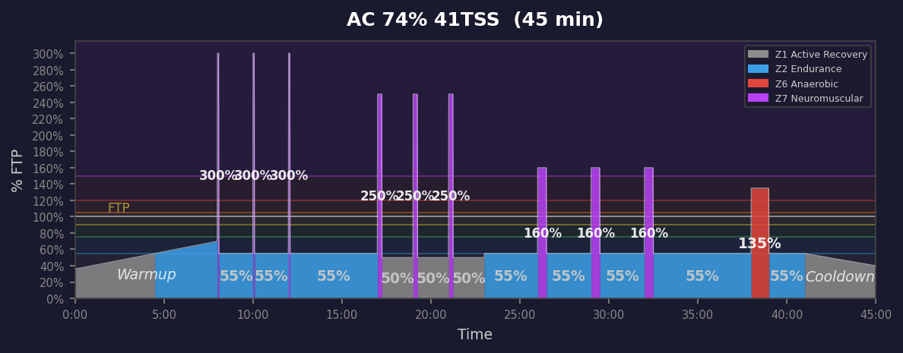
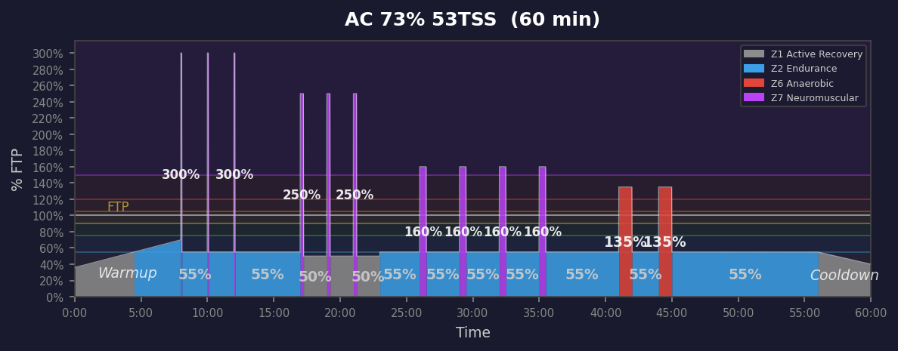
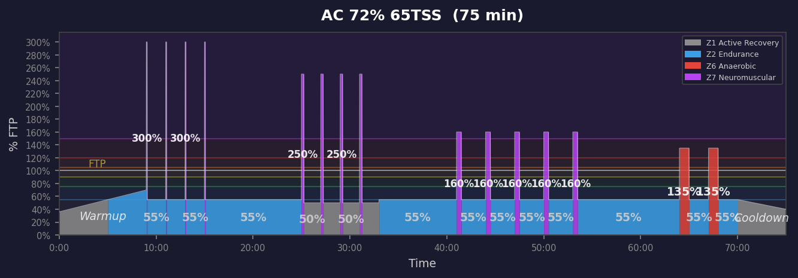

# Anaerobic Workouts

**5 workouts** — power profile graphs below.

| Duration | IF | TSS | Description |
|:--------:|:--:|:---:|:------------|
| 20m | 77% | 21 | 20min full sprint ladder: 2x5s + 2x15s + 2x30s. Targets ALL sprint durations 5-6 |
| 30m | 71% | 25 | 30min full sprint ladder: 2x5s + 2x15s + 2x30s. Targets ALL sprint durations 5-6 |
| 45m | 74% | 41 | 45min full sprint ladder: 3x5s + 3x15s + 3x30s + 1x60s. Targets ALL sprint durat |
| 60m | 73% | 53 | 60min full sprint ladder: 3x5s + 3x15s + 4x30s + 2x60s. Targets ALL sprint durat |
| 75m | 72% | 65 | 75min full sprint ladder: 4x5s + 4x15s + 5x30s + 2x60s. Targets ALL sprint durat |

---

## Power Profiles

### AC 77% 21TSS

### AC 71% 25TSS

### AC 74% 41TSS

### AC 73% 53TSS

### AC 72% 65TSS

