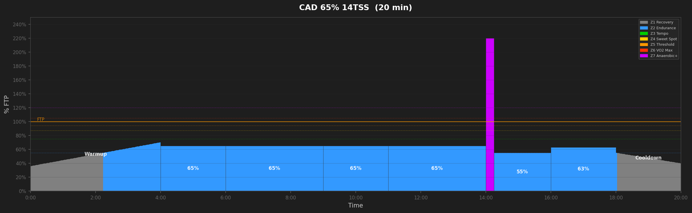
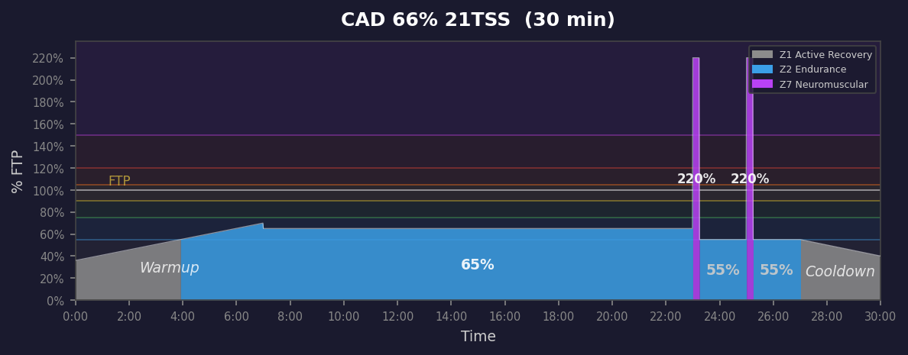
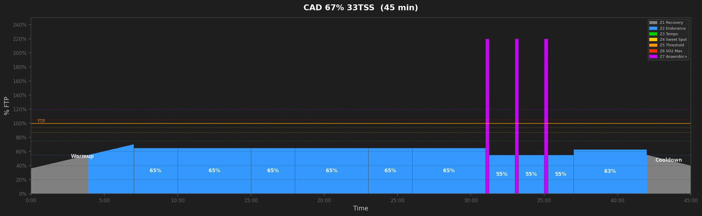
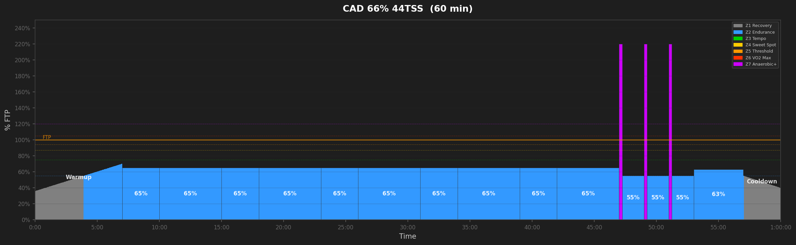
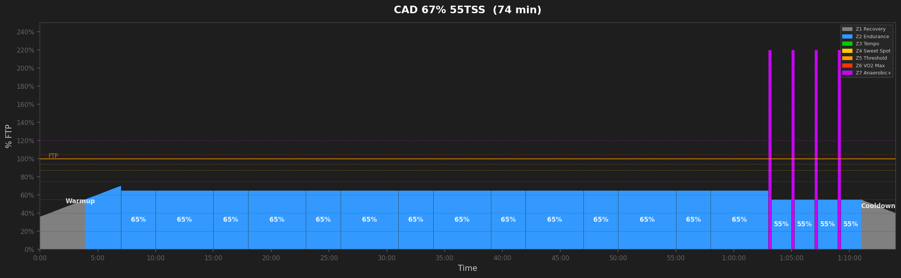
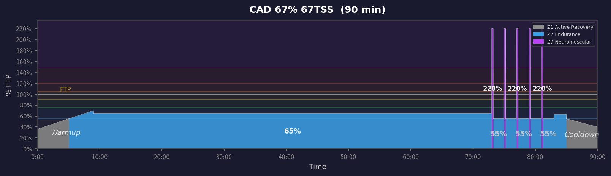
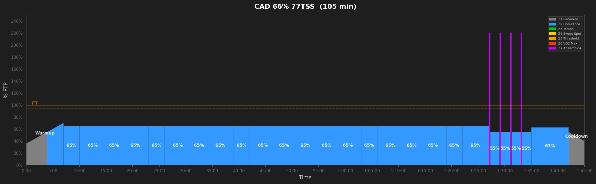
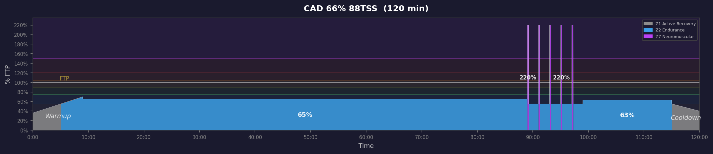

# Cadence Workouts

## CAD 65% 14TSS  (20 min)

_20min cadence drills with 1x15s neuromuscular burst. Trains pedaling efficiency and sprint snap._

---

## CAD 66% 21TSS  (30 min)

_30min cadence drills with 2x15s neuromuscular bursts. Trains pedaling efficiency and 5-15s explosive power._

---

## CAD 67% 33TSS  (45 min)

_45min cadence drills with 3x15s neuromuscular bursts. Trains pedaling efficiency and 5-15s explosive power._

---

## CAD 66% 44TSS  (60 min)

_60min cadence drills with 3x15s neuromuscular bursts. Trains pedaling efficiency and 5-15s explosive power._

---

## CAD 67% 55TSS  (74 min)

_75min cadence drills with 4x15s neuromuscular bursts. Trains pedaling efficiency and 5-15s explosive power._

---

## CAD 67% 67TSS  (90 min)

_90min cadence drills with 4x15s neuromuscular bursts. Trains pedaling efficiency and 5-15s explosive power._

---

## CAD 66% 77TSS  (105 min)

_105min cadence drills with 4x15s neuromuscular bursts. Trains pedaling efficiency and 5-15s explosive power._

---

## CAD 66% 88TSS  (120 min)

_120min cadence drills with 4x15s neuromuscular bursts. Trains pedaling efficiency and 5-15s explosive power._

---
