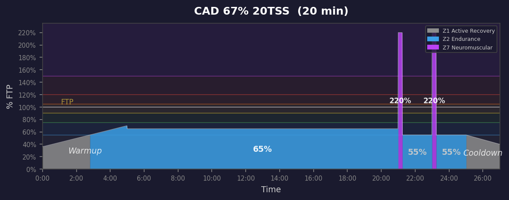
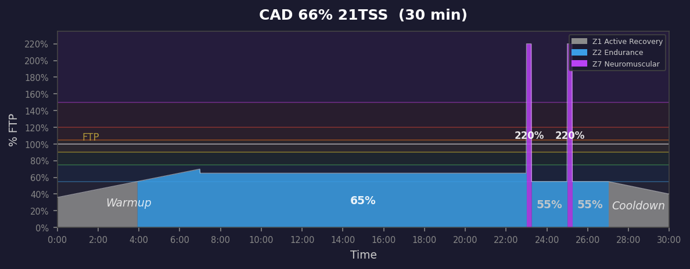
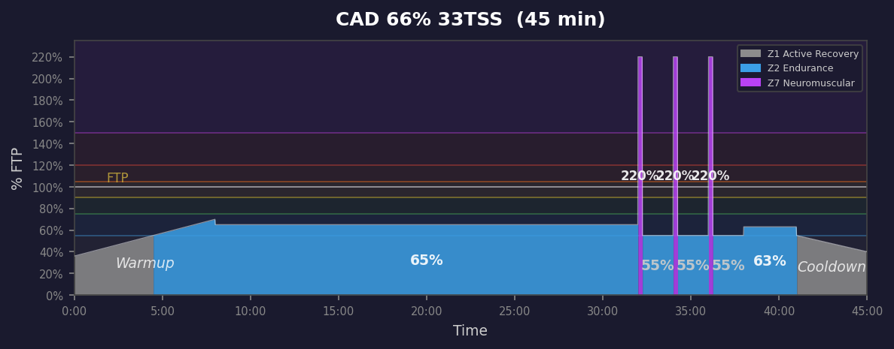
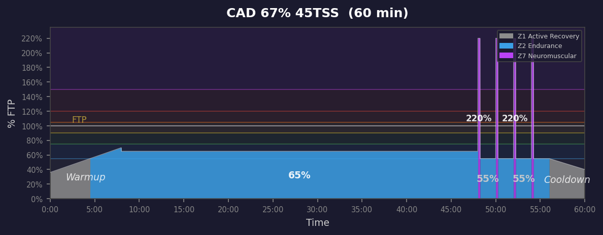
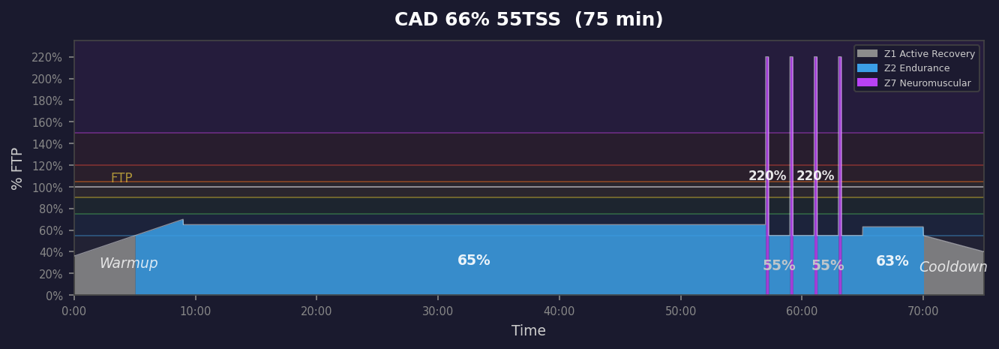
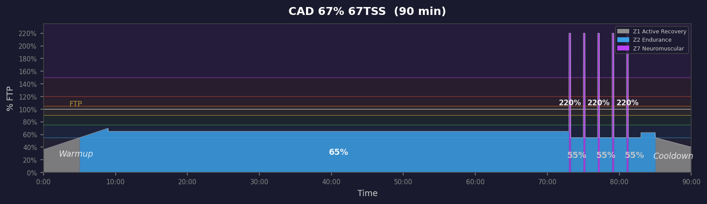
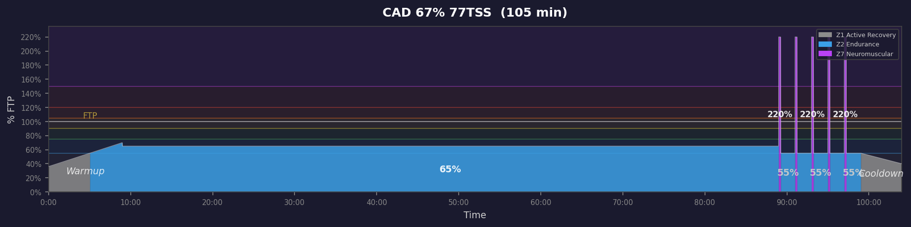
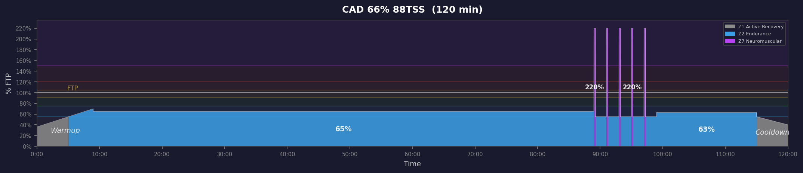
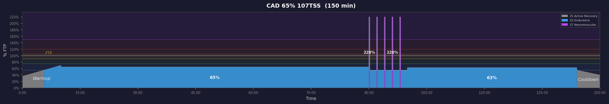

# Cadence Workouts

**9 workouts** — power profile graphs below.

| Duration | IF | TSS | Description |
|:--------:|:--:|:---:|:------------|
| 20m | 67% | 20 | 20min cadence drills (2 sets) with 2x15s bursts. Trains pedaling efficiency and  |
| 30m | 66% | 21 | 30min cadence drills (2 sets) with 2x15s bursts. Trains pedaling efficiency and  |
| 45m | 66% | 33 | 45min cadence drills (3 sets) with 3x15s bursts. Trains pedaling efficiency and  |
| 60m | 67% | 45 | 60min cadence drills (5 sets) with 4x15s bursts. Trains pedaling efficiency and  |
| 75m | 66% | 55 | 75min cadence drills (6 sets) with 4x15s bursts. Trains pedaling efficiency and  |
| 90m | 67% | 67 | 90min cadence drills (8 sets) with 5x15s bursts. Trains pedaling efficiency and  |
| 105m | 67% | 77 | 105min cadence drills (10 sets) with 5x15s bursts. Trains pedaling efficiency an |
| 120m | 66% | 88 | 120min cadence drills (10 sets) with 5x15s bursts. Trains pedaling efficiency an |
| 150m | 65% | 107 | 150min cadence drills (10 sets) with 5x15s bursts. Trains pedaling efficiency an |

---

## Power Profiles

### 020m Cadence 67% 20TSS

### 030m Cadence 66% 21TSS

### 045m Cadence 66% 33TSS

### 060m Cadence 67% 45TSS

### 075m Cadence 66% 55TSS

### 090m Cadence 67% 67TSS

### 105m Cadence 67% 77TSS

### 120m Cadence 66% 88TSS

### 150m Cadence 65% 107TSS

