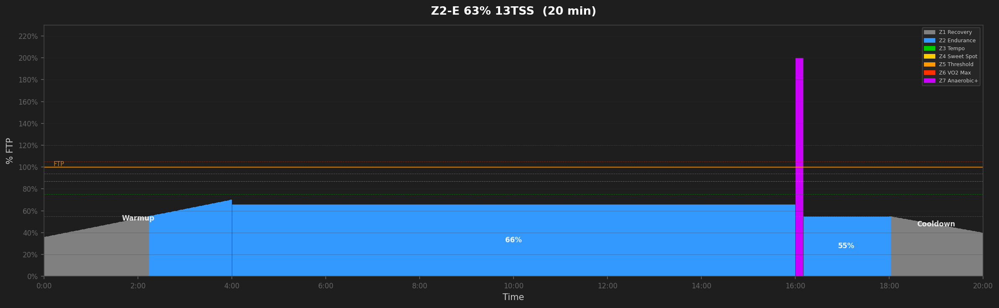
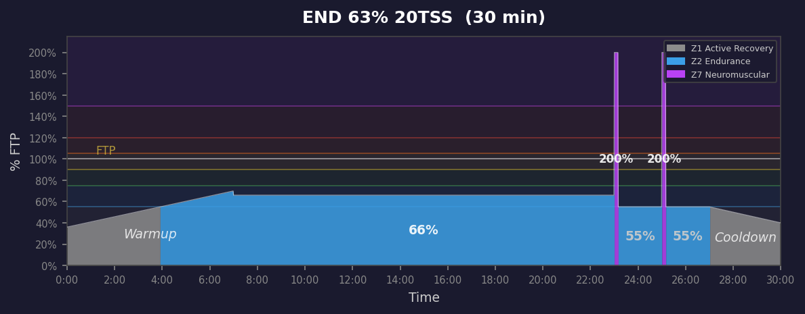
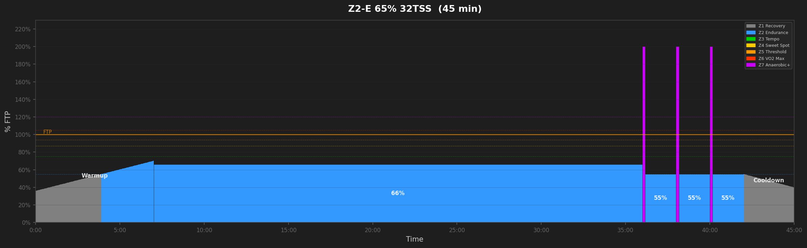
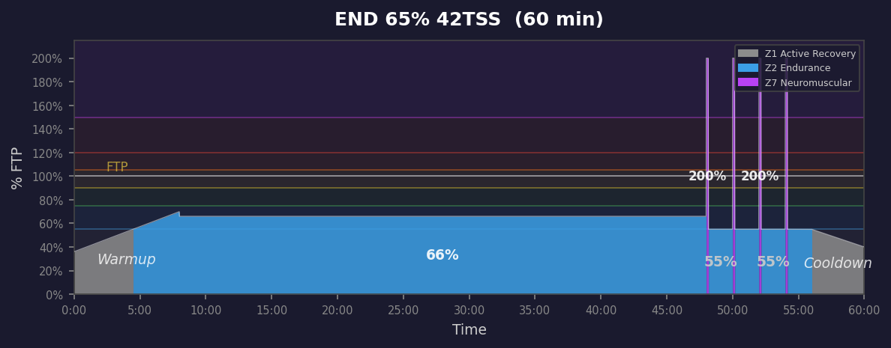
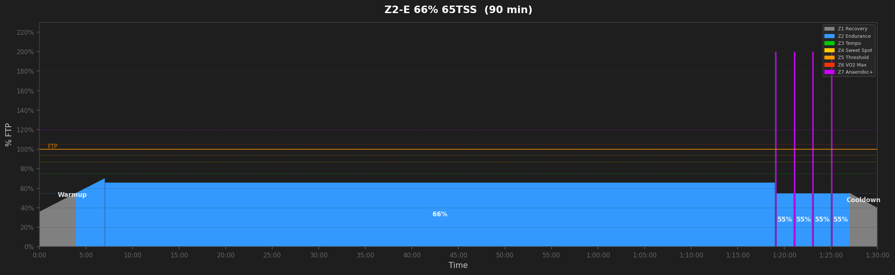
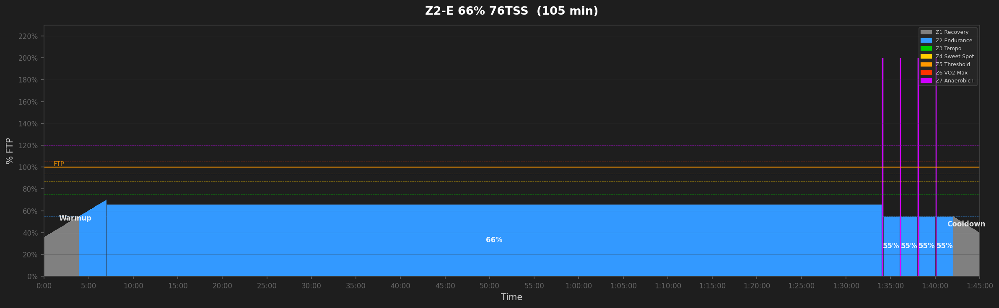
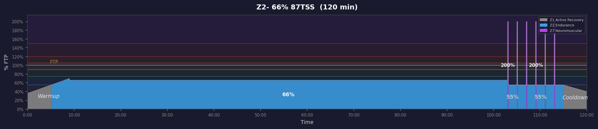

# Endurance Workouts

## Z2-E 63% 13TSS  (20 min)

_20min Z2 endurance with 1x10s sprint opener. Builds aerobic base while maintaining neuromuscular snap._

---

## Z2-E 63% 20TSS  (30 min)

_30min Z2 endurance with 2x10s sprint openers. Builds aerobic base while maintaining neuromuscular snap._

---

## Z2-E 65% 32TSS  (45 min)

_45min Z2 endurance with 3x10s sprint openers. Builds aerobic base while maintaining neuromuscular snap._

---

## Z2-E 65% 42TSS  (60 min)

_60min Z2 endurance with 3x10s sprint openers. Builds aerobic base while maintaining neuromuscular snap._

---

## Z2-E 66% 54TSS  (75 min)

_75min Z2 endurance with 4x10s sprint openers. Builds aerobic base while maintaining neuromuscular snap._

---

## Z2-E 66% 65TSS  (90 min)

_90min Z2 endurance with 4x10s sprint openers. Builds aerobic base while maintaining neuromuscular snap._

---

## Z2-E 66% 76TSS  (105 min)

_105min Z2 endurance with 4x10s sprint openers. Builds aerobic base while maintaining neuromuscular snap._

---

## Z2-E 66% 87TSS  (120 min)

_120min Z2 endurance with 4x10s sprint openers. Builds aerobic base while maintaining neuromuscular snap._

---
