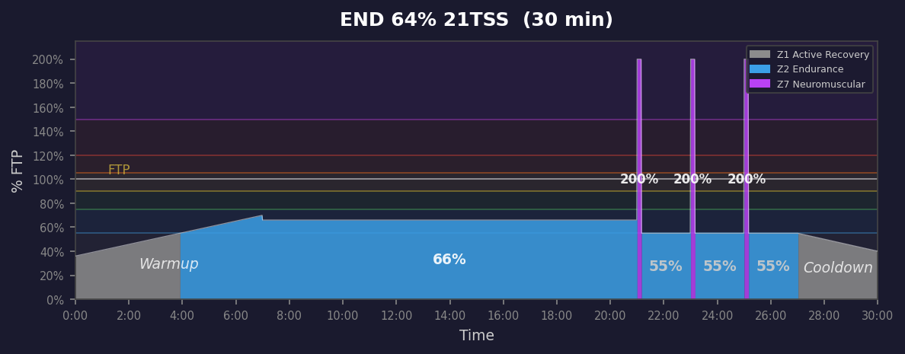

# Endurance Workouts

**15 workouts** — power profile graphs below.

| Duration | IF | TSS | Description |
|:--------:|:--:|:---:|:------------|
| 20m | 64% | 14 | 20min Z2 endurance with 2x10s sprint openers. Builds aerobic base while maintain |
| 30m | 64% | 21 | 30min Z2 endurance with 3x10s sprint openers. Builds aerobic base while maintain |
| 45m | 64% | 31 | 45min Z2 endurance with 3x10s sprint openers. Builds aerobic base while maintain |
| 60m | 65% | 42 | 60min Z2 endurance with 4x10s sprint openers. Builds aerobic base while maintain |
| 75m | 65% | 53 | 75min Z2 endurance with 4x10s sprint openers. Builds aerobic base while maintain |
| 90m | 65% | 64 | 90min Z2 endurance with 5x10s sprint openers. Builds aerobic base while maintain |
| 105m | 65% | 75 | 105min Z2 endurance with 5x10s sprint openers. Builds aerobic base while maintai |
| 120m | 66% | 87 | 120min Z2 endurance with 6x10s sprint openers. Builds aerobic base while maintai |
| 150m | 66% | 108 | 150min Z2 endurance with 6x10s sprint openers. Builds aerobic base while maintai |
| 180m | 66% | 130 | 180min Z2 endurance with 6x10s sprint openers. Builds aerobic base while maintai |
| 240m | 66% | 172 | 240min Z2 endurance with 6x10s sprint openers. Builds aerobic base while maintai |
| 300m | 65% | 214 | 300min Z2 endurance with 6x10s sprint openers. Builds aerobic base while maintai |
| 360m | 66% | 257 | 360min Z2 endurance with 6x10s sprint openers. Builds aerobic base while maintai |
| 420m | 65% | 299 | 420min Z2 endurance with 6x10s sprint openers. Builds aerobic base while maintai |
| 450m | 65% | 321 | 450min Z2 endurance with 6x10s sprint openers. Builds aerobic base while maintai |

---

## Power Profiles

### 020m Endurance 64% 14TSS

### 030m Endurance 64% 21TSS

### 045m Endurance 64% 31TSS

### 060m Endurance 65% 42TSS

### 075m Endurance 65% 53TSS

### 090m Endurance 65% 64TSS

### 105m Endurance 65% 75TSS

### 120m Endurance 66% 87TSS

### 150m Endurance 66% 108TSS

### 180m Endurance 66% 130TSS

### 240m Endurance 66% 172TSS

### 300m Endurance 65% 214TSS

### 360m Endurance 66% 257TSS

### 420m Endurance 65% 299TSS

### 450m Endurance 65% 321TSS

