# Endurance Workouts

**21 workouts** — power profile graphs below.

| Duration | IF | TSS | Description |
|:--------:|:--:|:---:|:------------|
| 20m | 64% | 14 | 20min Z2 endurance with 2x10s sprint openers. Builds aerobic base while maintain |
| 30m | 63% | 20 | 30min Z2 endurance with 2x10s sprint openers. Builds aerobic base while maintain |
| 45m | 64% | 31 | 45min Z2 endurance with 3x10s sprint openers. Builds aerobic base while maintain |
| 60m | 65% | 42 | 60min Z2 endurance with 4x10s sprint openers. Builds aerobic base while maintain |
| 75m | 65% | 53 | 75min Z2 endurance with 4x10s sprint openers. Builds aerobic base while maintain |
| 90m | 65% | 64 | 90min Z2 endurance with 5x10s sprint openers. Builds aerobic base while maintain |
| 105m | 65% | 75 | 105min Z2 endurance with 5x10s sprint openers. Builds aerobic base while maintai |
| 120m | 66% | 87 | 120min Z2 endurance with 6x10s sprint openers. Builds aerobic base while maintai |
| 150m | 66% | 108 | 150min Z2 endurance with 6x10s sprint openers. Builds aerobic base while maintai |
| 160m | 66% | 115 | 160min Z2 endurance with 6x10s sprint openers. Builds aerobic base while maintai |
| 180m | 66% | 130 | 180min Z2 endurance with 6x10s sprint openers. Builds aerobic base while maintai |
| 200m | 65% | 143 | 200min Z2 endurance with 6x10s sprint openers. Builds aerobic base while maintai |
| 220m | 66% | 157 | 220min Z2 endurance with 6x10s sprint openers. Builds aerobic base while maintai |
| 240m | 66% | 172 | 240min Z2 endurance with 6x10s sprint openers. Builds aerobic base while maintai |
| 270m | 65% | 192 | 270min Z2 endurance with 6x10s sprint openers. Builds aerobic base while maintai |
| 300m | 65% | 214 | 300min Z2 endurance with 6x10s sprint openers. Builds aerobic base while maintai |
| 330m | 65% | 236 | 330min Z2 endurance with 6x10s sprint openers. Builds aerobic base while maintai |
| 360m | 66% | 257 | 360min Z2 endurance with 6x10s sprint openers. Builds aerobic base while maintai |
| 390m | 65% | 277 | 390min Z2 endurance with 6x10s sprint openers. Builds aerobic base while maintai |
| 420m | 65% | 299 | 420min Z2 endurance with 6x10s sprint openers. Builds aerobic base while maintai |
| 450m | 65% | 321 | 450min Z2 endurance with 6x10s sprint openers. Builds aerobic base while maintai |

---

## Power Profiles

### Z2-E 64% 14TSS

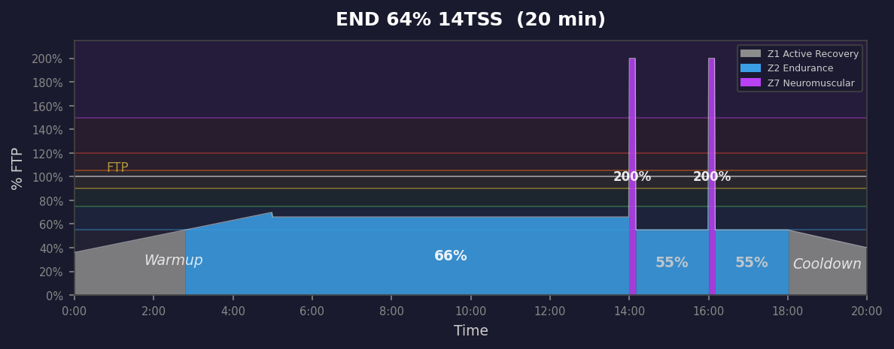

### Z2-E 63% 20TSS

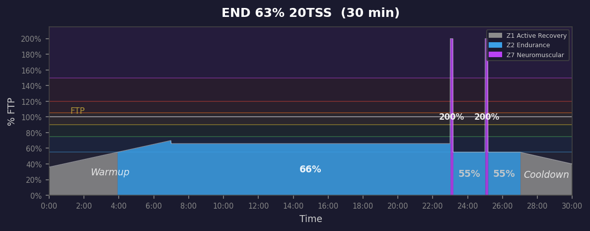

### Z2-E 64% 31TSS

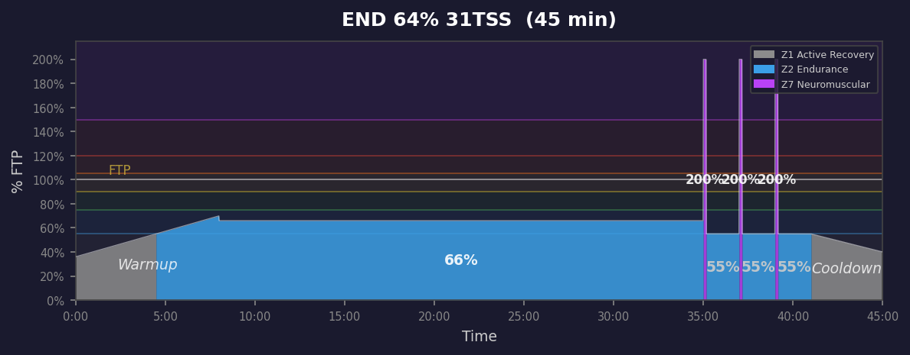

### Z2-E 65% 42TSS

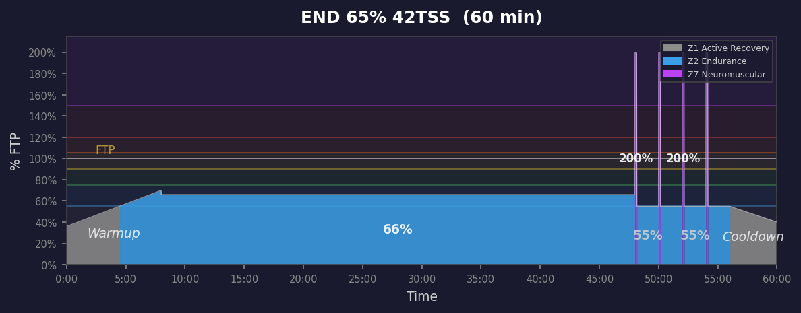

### Z2-E 65% 53TSS

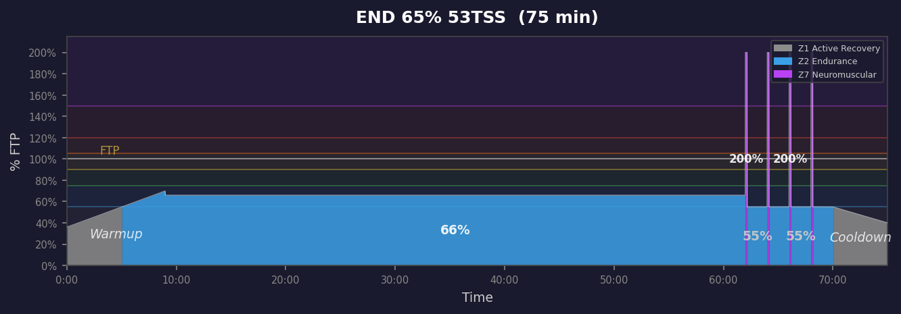

### Z2-E 65% 64TSS

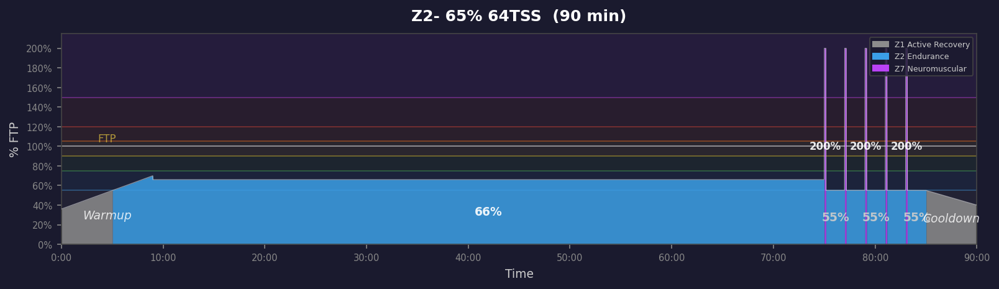

### Z2-E 65% 75TSS

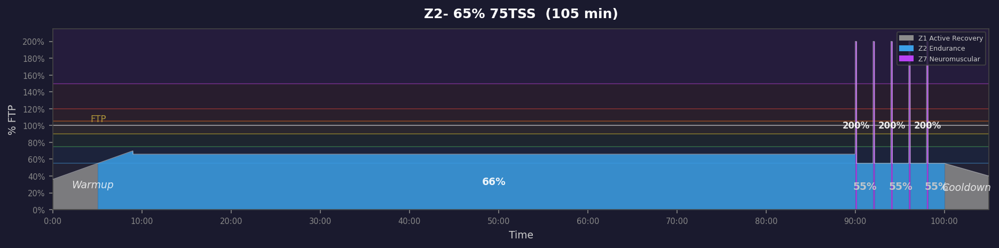

### Z2-E 66% 87TSS

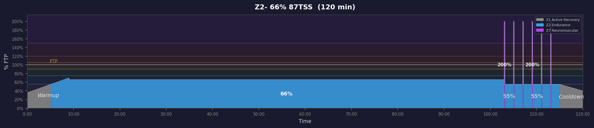

### Z2-E 66% 108TSS

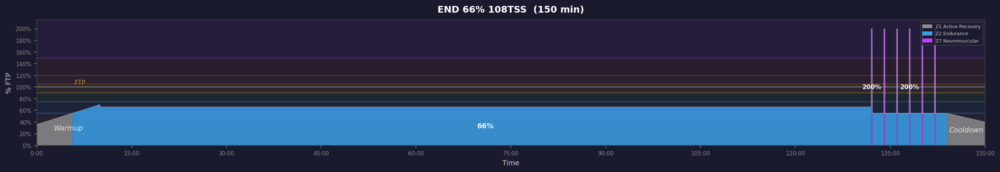

### Z2-E 66% 115TSS

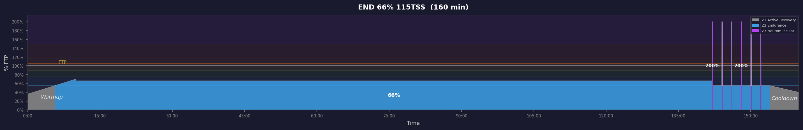

### Z2-E 66% 130TSS

### Z2-E 65% 143TSS

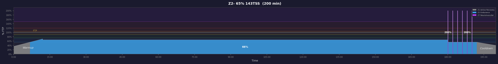

### Z2-E 66% 157TSS

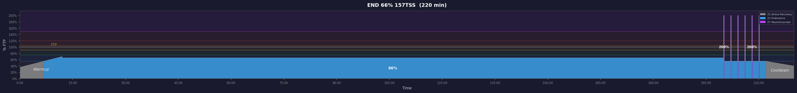

### Z2-E 66% 172TSS

### Z2-E 65% 192TSS

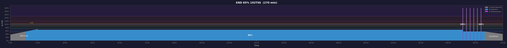

### Z2-E 65% 214TSS

### Z2-E 65% 236TSS

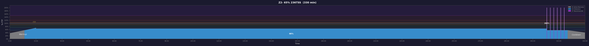

### Z2-E 66% 257TSS

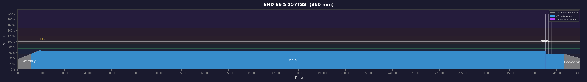

### Z2-E 65% 277TSS

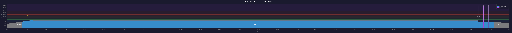

### Z2-E 65% 299TSS

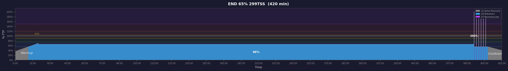

### Z2-E 65% 321TSS

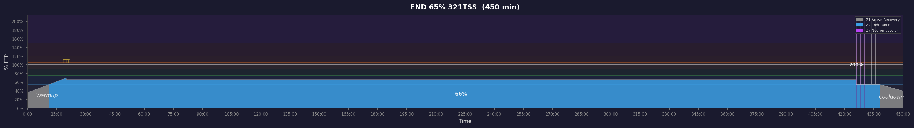

