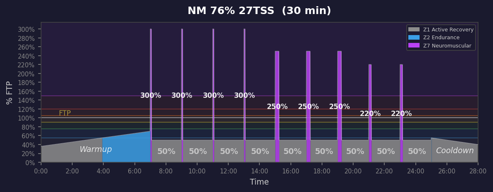
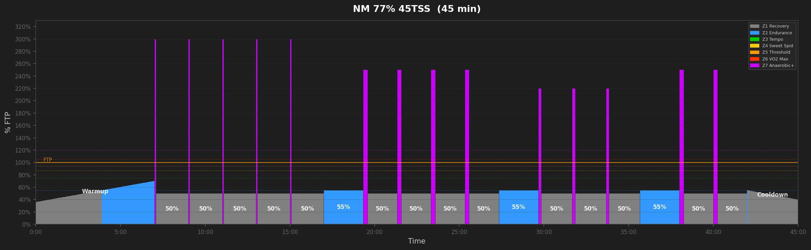
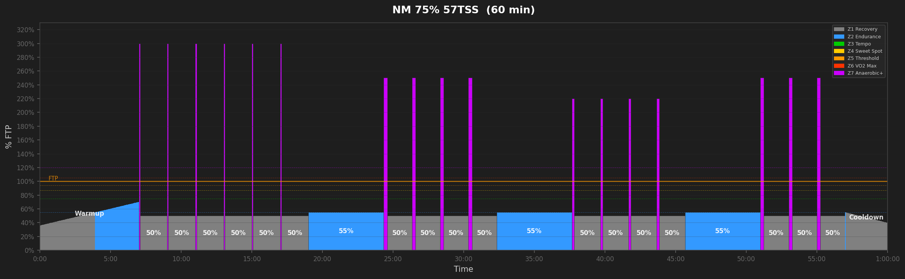
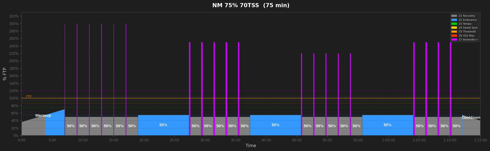
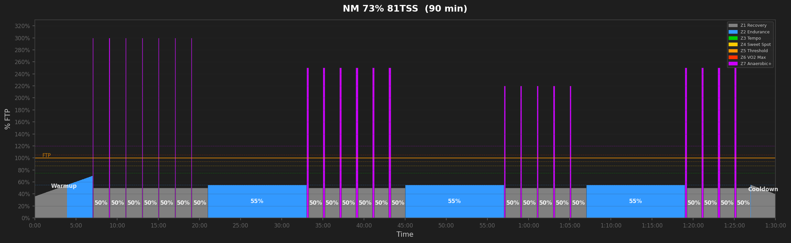
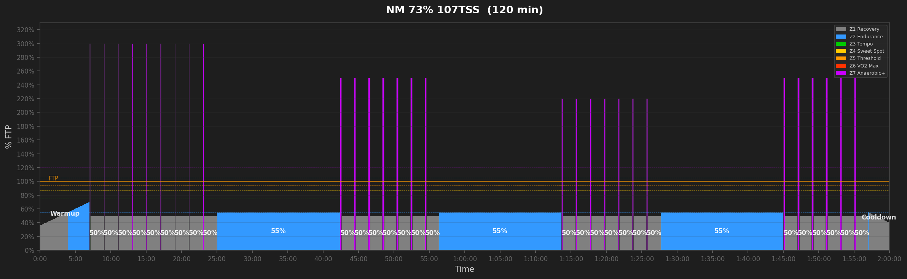

# Neuromuscular Workouts

## NM 74% 18TSS  (20 min)

_20min neuromuscular sprints: 3x5s + 2x15s + 1x10s seated. Pure peak power with full recovery._

---

## NM 76% 27TSS  (28 min)

_30min neuromuscular sprint training: 4x5s + 3x15s hold + 2x10s seated. Pure peak power with full recovery. Phosphocreatine system: targets 5-15s max sprint._

---

## NM 77% 45TSS  (45 min)

_45min neuromuscular sprint training: 5x5s + 4x15s hold + 3x10s seated + 2x15s standing. Pure peak power with full recovery. Phosphocreatine system: targets 5-15s max sprint._

---

## NM 75% 57TSS  (60 min)

_60min neuromuscular sprint training: 6x5s + 4x15s hold + 4x10s seated + 3x15s standing. Pure peak power with full recovery. Phosphocreatine system: targets 5-15s max sprint._

---

## NM 75% 70TSS  (75 min)

_75min neuromuscular sprint training: 6x5s + 5x15s hold + 5x10s seated + 4x15s standing. Pure peak power with full recovery. Phosphocreatine system: targets 5-15s max sprint._

---

## NM 73% 81TSS  (90 min)

_90min neuromuscular sprint training: 7x5s + 6x15s hold + 5x10s seated + 4x15s standing. Pure peak power with full recovery. Phosphocreatine system: targets 5-15s max sprint._

---

## NM 73% 93TSS  (105 min)

_105min neuromuscular sprint training: 8x5s + 6x15s hold + 6x10s seated + 5x15s standing. Pure peak power with full recovery. Phosphocreatine system: targets 5-15s max sprint._

---

## NM 73% 107TSS  (120 min)

_120min neuromuscular sprint training: 9x5s + 7x15s hold + 7x10s seated + 6x15s standing. Pure peak power with full recovery. Phosphocreatine system: targets 5-15s max sprint._

---
