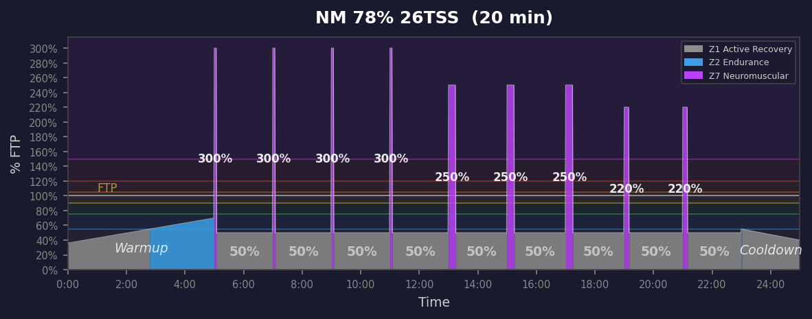
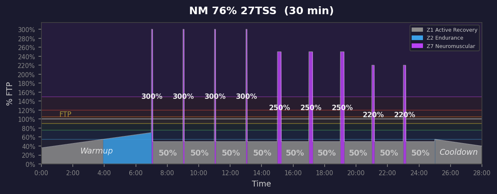
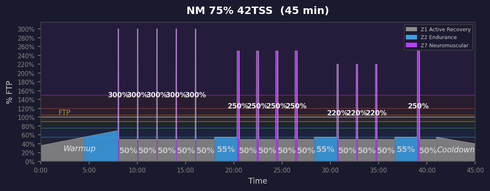
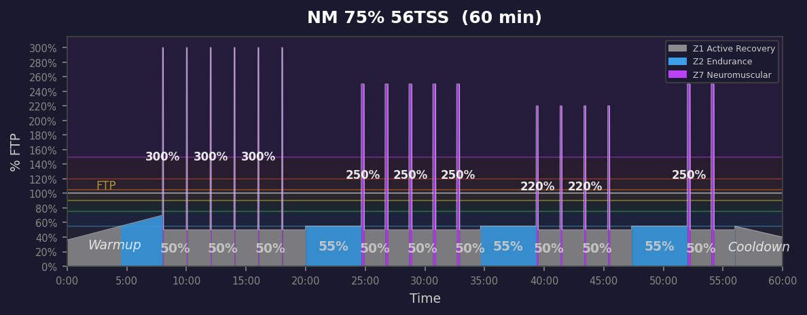
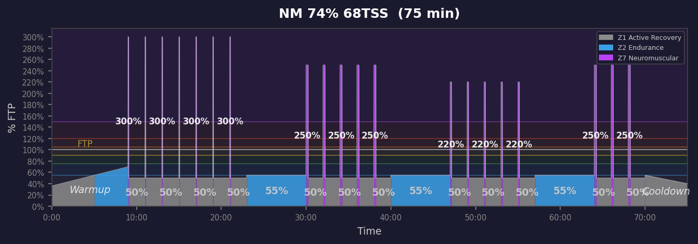

# Neuromuscular Workouts

**5 workouts** — power profile graphs below.

| Duration | IF | TSS | Description |
|:--------:|:--:|:---:|:------------|
| 20m | 78% | 26 | 20min neuromuscular sprint training: 4x5s + 3x15s hold + 2x10s seated. Pure peak |
| 30m | 76% | 27 | 30min neuromuscular sprint training: 4x5s + 3x15s hold + 2x10s seated. Pure peak |
| 45m | 75% | 42 | 45min neuromuscular sprint training: 5x5s + 4x15s hold + 3x10s seated + 1x15s st |
| 60m | 75% | 56 | 60min neuromuscular sprint training: 6x5s + 5x15s hold + 4x10s seated + 2x15s st |
| 75m | 74% | 68 | 75min neuromuscular sprint training: 7x5s + 5x15s hold + 5x10s seated + 3x15s st |

---

## Power Profiles

### 020m Neuromuscular 78% 26TSS

### 030m Neuromuscular 76% 27TSS

### 045m Neuromuscular 75% 42TSS

### 060m Neuromuscular 75% 56TSS

### 075m Neuromuscular 74% 68TSS

