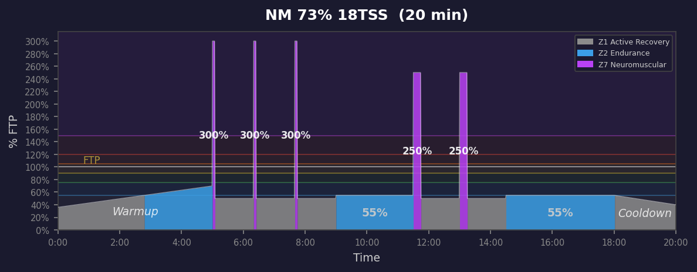
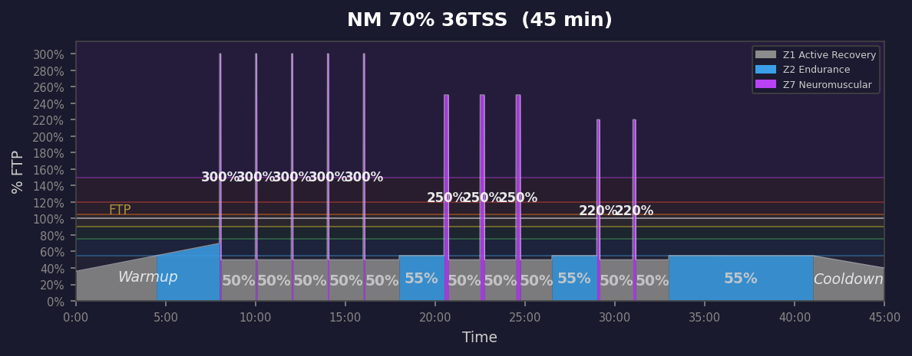
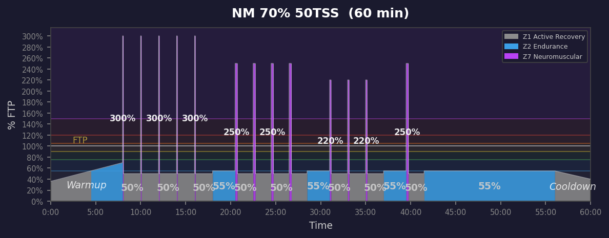
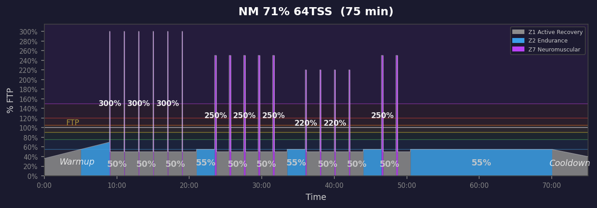

# Neuromuscular Workouts

**4 workouts** — power profile graphs below.

| Duration | IF | TSS | Description |
|:--------:|:--:|:---:|:------------|
| 20m | 73% | 18 | 20min neuromuscular sprint training: 3x5s + 2x15s hold. Pure peak power with ful |
| 45m | 70% | 36 | 45min neuromuscular sprint training: 5x5s + 3x15s hold + 2x10s seated. Pure peak |
| 60m | 70% | 50 | 60min neuromuscular sprint training: 5x5s + 4x15s hold + 3x10s seated + 1x15s st |
| 75m | 71% | 64 | 75min neuromuscular sprint training: 6x5s + 5x15s hold + 4x10s seated + 2x15s st |

---

## Power Profiles

### 020m Neuromuscular 73% 18TSS

### 045m Neuromuscular 70% 36TSS

### 060m Neuromuscular 70% 50TSS

### 075m Neuromuscular 71% 64TSS

