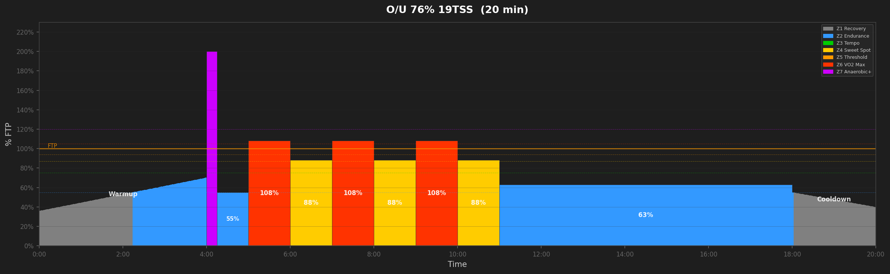
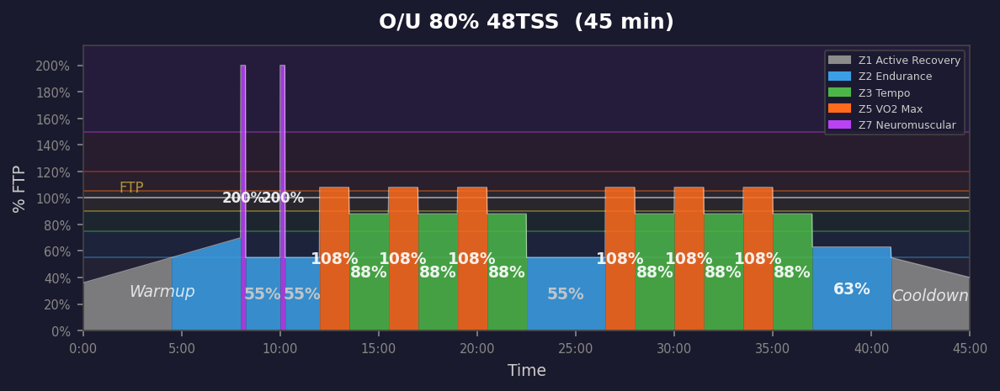
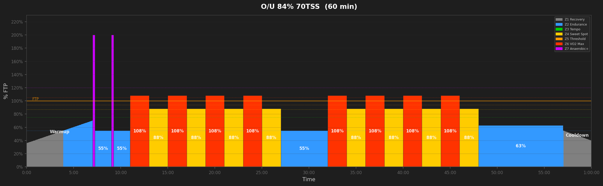
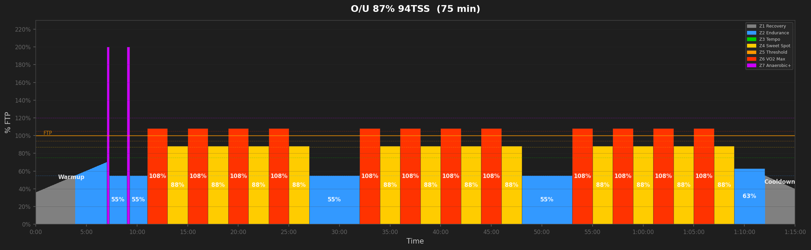
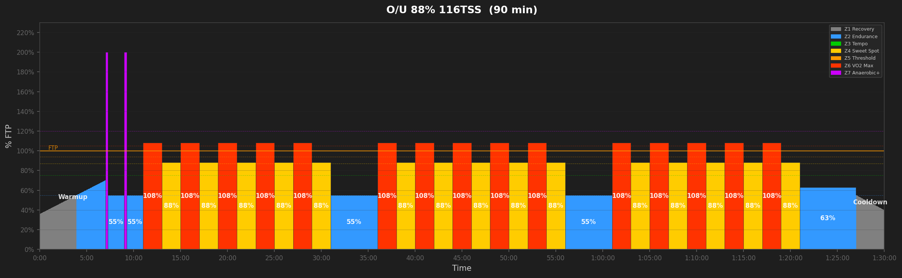
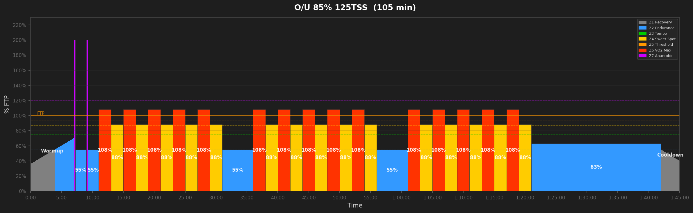
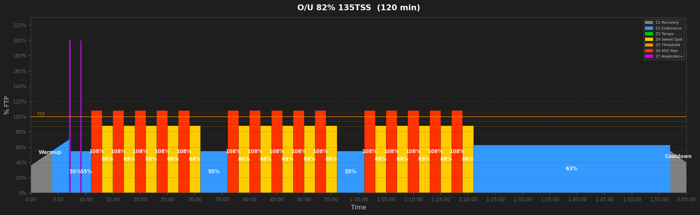

# Over-Unders Workouts

## O/U 76% 19TSS  (20 min)

_20min over/unders: 1x3 reps (60s@108% / 60s@88%). Builds lactate clearance and race-pace surging._

---

## O/U 78% 30TSS  (30 min)

_30min over/unders: 1x4 reps (90s@108% / 90s@88%). Builds lactate clearance and race-pace surging._

---

## O/U 80% 48TSS  (45 min)

_45min over/unders: 2x3 reps (90s@108% / 120s@88%). Builds lactate clearance and race-pace surging._

---

## O/U 84% 70TSS  (60 min)

_60min over/unders: 2x4 reps (120s@108% / 120s@88%). Builds lactate clearance and race-pace surging._

---

## O/U 87% 94TSS  (75 min)

_75min over/unders: 3x4 reps (120s@108% / 120s@88%). Builds lactate clearance and race-pace surging._

---

## O/U 88% 116TSS  (90 min)

_90min over/unders: 3x5 reps (120s@108% / 120s@88%). Builds lactate clearance and race-pace surging._

---

## O/U 85% 125TSS  (105 min)

_105min over/unders: 3x5 reps (120s@108% / 120s@88%). Builds lactate clearance and race-pace surging._

---

## O/U 82% 135TSS  (120 min)

_120min over/unders: 3x5 reps (120s@108% / 120s@88%). Builds lactate clearance and race-pace surging._

---
