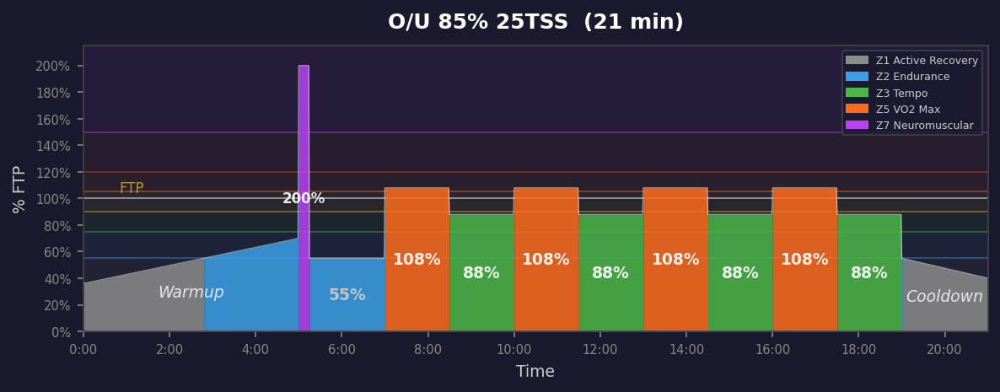
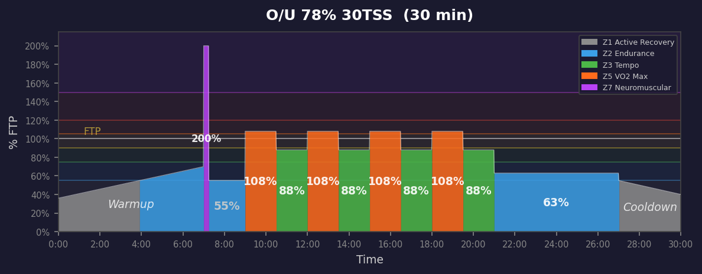
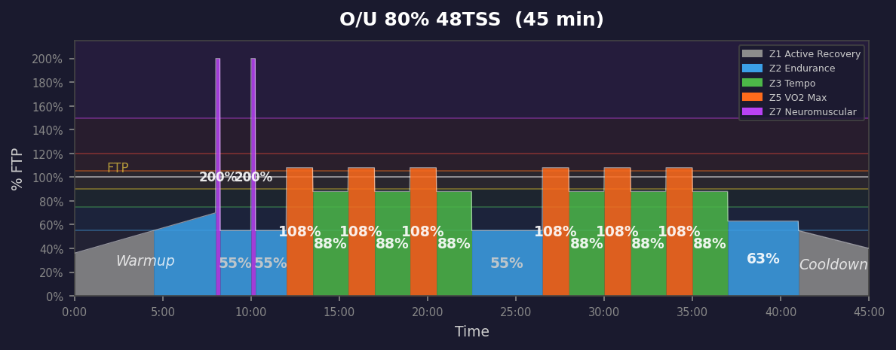
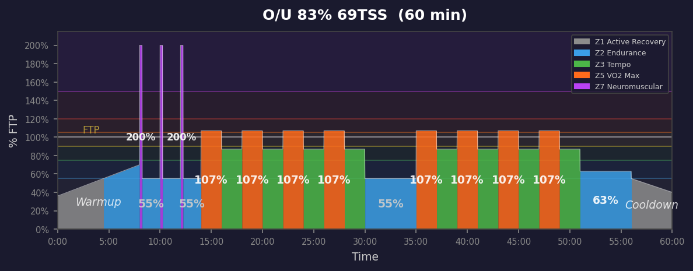
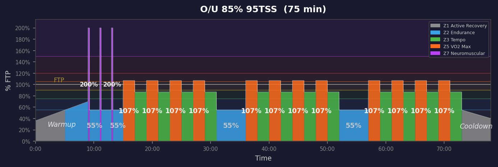
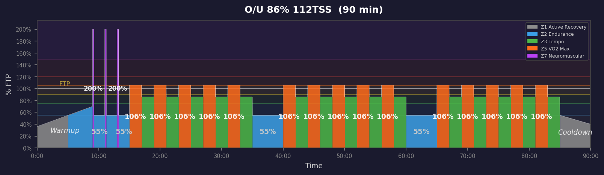
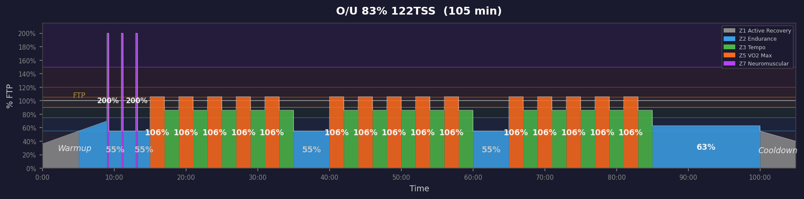
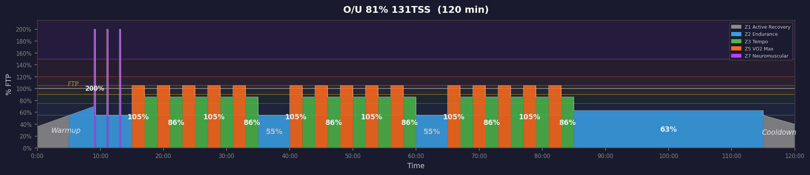

# Over-Unders Workouts

**8 workouts** — power profile graphs below.

| Duration | IF | TSS | Description |
|:--------:|:--:|:---:|:------------|
| 20m | 85% | 25 | 20min over/unders: 1x4 reps (90s@108% / 90s@88%). Builds lactate clearance and r |
| 30m | 78% | 30 | 30min over/unders: 1x4 reps (90s@108% / 90s@88%). Builds lactate clearance and r |
| 45m | 80% | 48 | 45min over/unders: 2x3 reps (90s@108% / 120s@88%). Builds lactate clearance and  |
| 60m | 83% | 69 | 60min over/unders: 2x4 reps (120s@107% / 120s@87%). Builds lactate clearance and |
| 75m | 85% | 95 | 75min over/unders: 3x4 reps (120s@107% / 120s@87%). Builds lactate clearance and |
| 90m | 86% | 112 | 90min over/unders: 3x5 reps (120s@106% / 120s@86%). Builds lactate clearance and |
| 105m | 83% | 122 | 105min over/unders: 3x5 reps (120s@106% / 120s@86%). Builds lactate clearance an |
| 120m | 81% | 131 | 120min over/unders: 3x5 reps (120s@105% / 120s@86%). Builds lactate clearance an |

---

## Power Profiles

### 020m OverUnders 85% 25TSS

### 030m OverUnders 78% 30TSS

### 045m OverUnders 80% 48TSS

### 060m OverUnders 83% 69TSS

### 075m OverUnders 85% 95TSS

### 090m OverUnders 86% 112TSS

### 105m OverUnders 83% 122TSS

### 120m OverUnders 81% 131TSS

