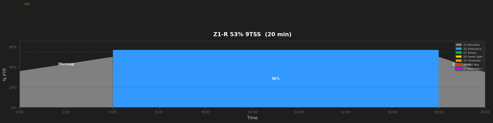
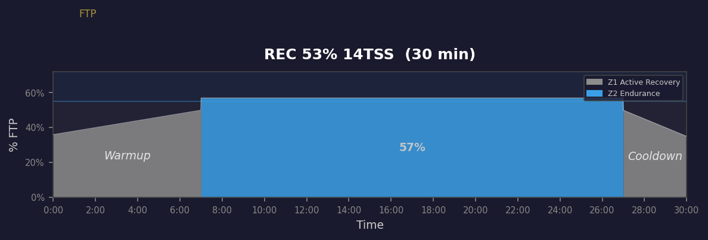
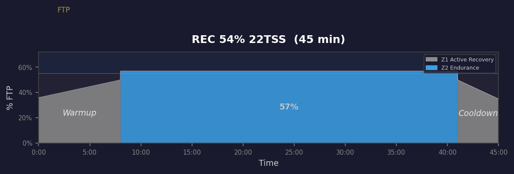
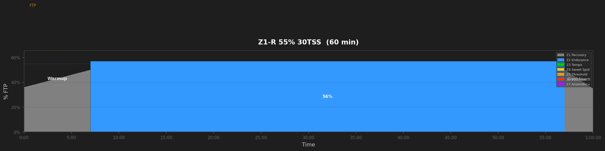
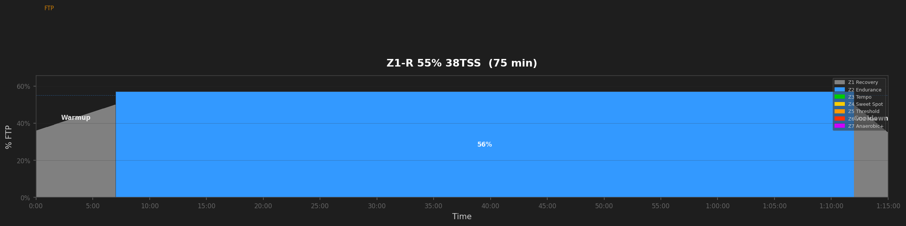
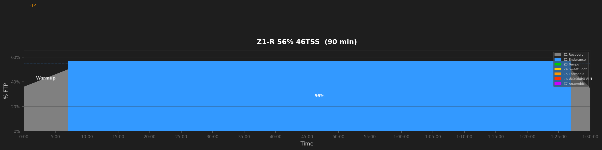
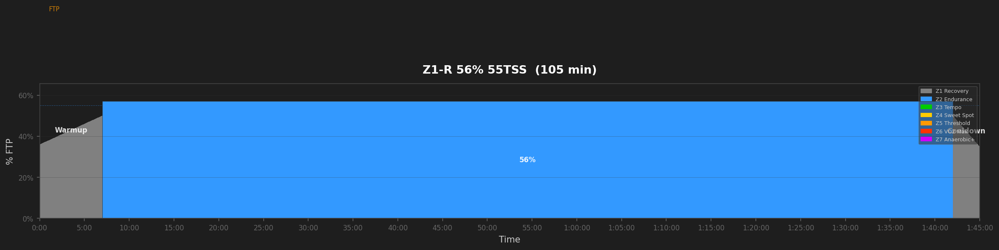

# Recovery Workouts

## Z1-R 53% 9TSS  (20 min)

_20min pure recovery. Easy spin, restore and refresh._

---

## Z1-R 53% 14TSS  (30 min)

_30min pure recovery. Easy spin, restore and refresh._

---

## Z1-R 54% 22TSS  (45 min)

_45min pure recovery. Easy spin, restore and refresh._

---

## Z1-R 55% 30TSS  (60 min)

_60min pure recovery. Easy spin, restore and refresh._

---

## Z1-R 55% 38TSS  (75 min)

_75min pure recovery. Easy spin, restore and refresh._

---

## Z1-R 56% 46TSS  (90 min)

_90min pure recovery. Easy spin, restore and refresh._

---

## Z1-R 56% 55TSS  (105 min)

_105min pure recovery. Easy spin, restore and refresh._

---

## Z1-R 56% 63TSS  (120 min)

_120min pure recovery. Easy spin, restore and refresh._

---
