# Recovery Workouts

**18 workouts** — power profile graphs below.

| Duration | IF | TSS | Description |
|:--------:|:--:|:---:|:------------|
| 20m | 52% | 9 | 20min pure recovery. Easy spin, restore and refresh. |
| 30m | 53% | 14 | 30min pure recovery. Easy spin, restore and refresh. |
| 45m | 54% | 22 | 45min pure recovery. Easy spin, restore and refresh. |
| 60m | 54% | 30 | 60min pure recovery. Easy spin, restore and refresh. |
| 75m | 55% | 37 | 75min pure recovery. Easy spin, restore and refresh. |
| 90m | 55% | 45 | 90min pure recovery. Easy spin, restore and refresh. |
| 105m | 55% | 54 | 105min pure recovery. Easy spin, restore and refresh. |
| 120m | 56% | 62 | 120min pure recovery. Easy spin, restore and refresh. |
| 150m | 56% | 77 | 150min pure recovery. Easy spin, restore and refresh. |
| 160m | 56% | 83 | 160min pure recovery. Easy spin, restore and refresh. |
| 180m | 56% | 94 | 180min pure recovery. Easy spin, restore and refresh. |
| 200m | 56% | 104 | 200min pure recovery. Easy spin, restore and refresh. |
| 220m | 56% | 114 | 220min pure recovery. Easy spin, restore and refresh. |
| 240m | 56% | 125 | 240min pure recovery. Easy spin, restore and refresh. |
| 270m | 56% | 140 | 270min pure recovery. Easy spin, restore and refresh. |
| 300m | 56% | 157 | 300min pure recovery. Easy spin, restore and refresh. |
| 330m | 56% | 173 | 330min pure recovery. Easy spin, restore and refresh. |
| 360m | 56% | 189 | 360min pure recovery. Easy spin, restore and refresh. |

---

## Power Profiles

### 020m Recovery 52% 9TSS

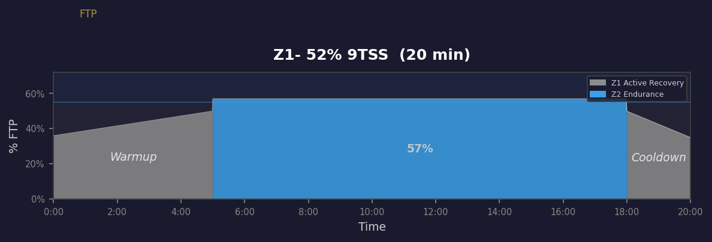

### 030m Recovery 53% 14TSS

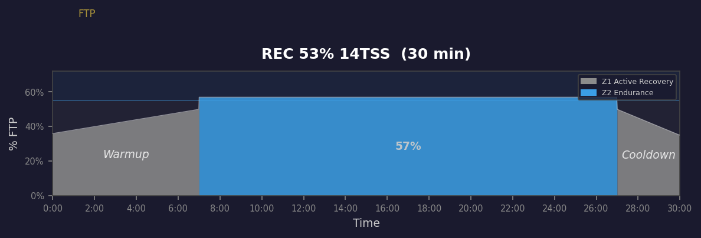

### 045m Recovery 54% 22TSS

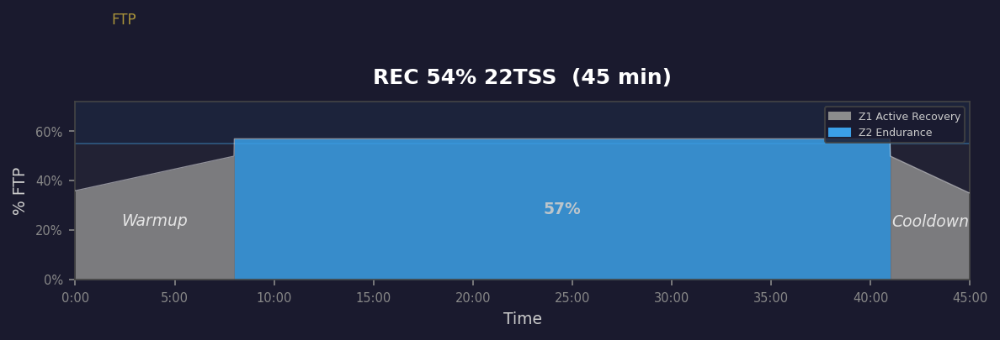

### 060m Recovery 54% 30TSS

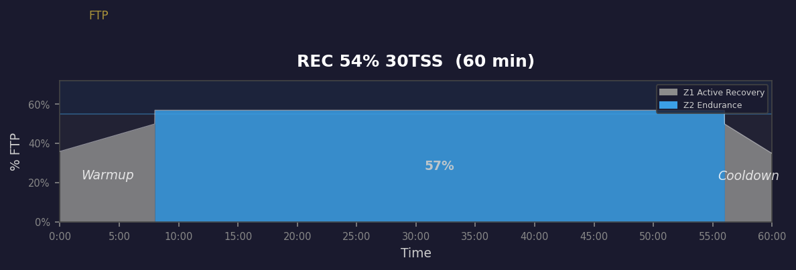

### 075m Recovery 55% 37TSS

### 090m Recovery 55% 45TSS

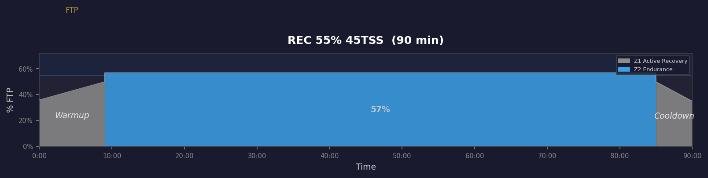

### 105m Recovery 55% 54TSS

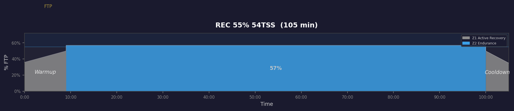

### 120m Recovery 56% 62TSS

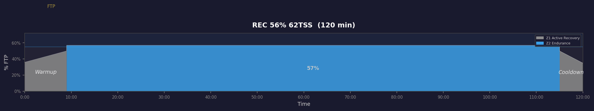

### 150m Recovery 56% 77TSS

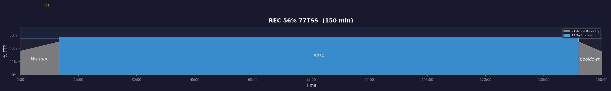

### 160m Recovery 56% 83TSS

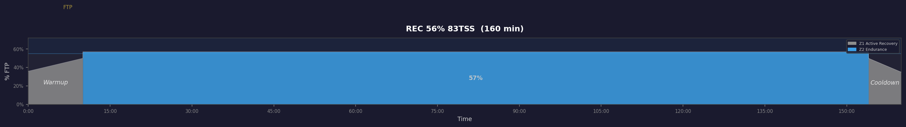

### 180m Recovery 56% 94TSS

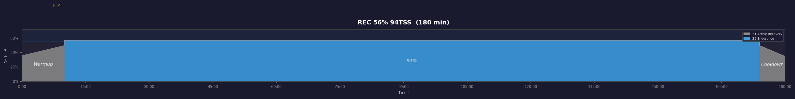

### 200m Recovery 56% 104TSS

### 220m Recovery 56% 114TSS

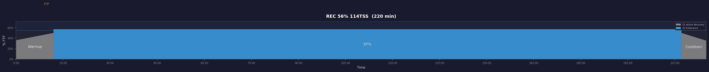

### 240m Recovery 56% 125TSS

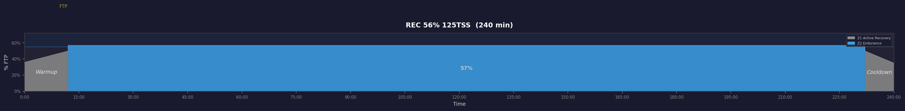

### 270m Recovery 56% 140TSS

### 300m Recovery 56% 157TSS

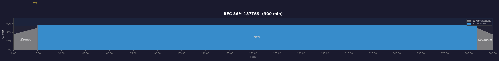

### 330m Recovery 56% 173TSS

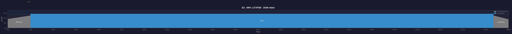

### 360m Recovery 56% 189TSS

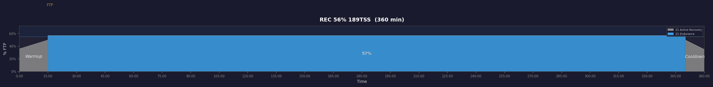

