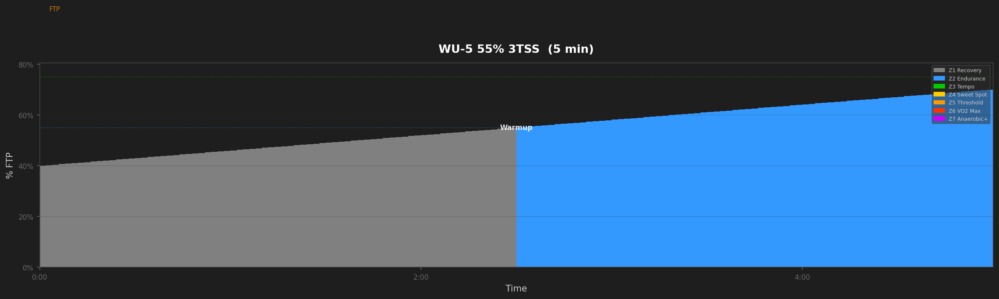
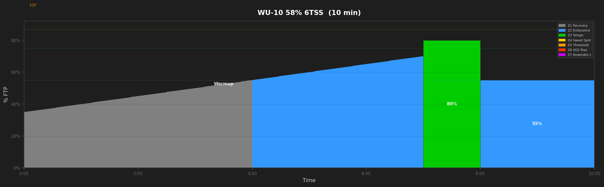
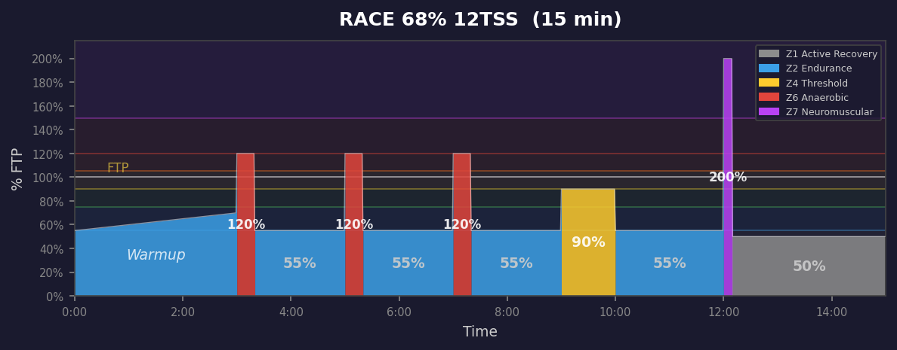
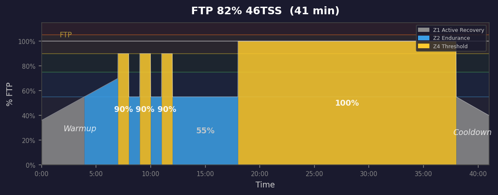

# Special Workouts

## WU-5 55% 3TSS  (5 min)

_5min basic warmup. Progressive build from easy to moderate. Perfect for short workouts or time-crunched days._

---

## WU-10 58% 6TSS  (10 min)

_10min basic warmup. Gradual progressive build with tempo touch. Prepares body and mind for harder efforts._

---

## R-WU 68% 12TSS  (15 min)

_15min pre-race warmup. 3 openers + threshold check + sprint snap. You'll be activated and ready._

---

## FTP-T 82% 46TSS  (41 min)

_50min FTP test protocol. 20min max effort. Multiply avg power by 0.95 for new FTP._

---
