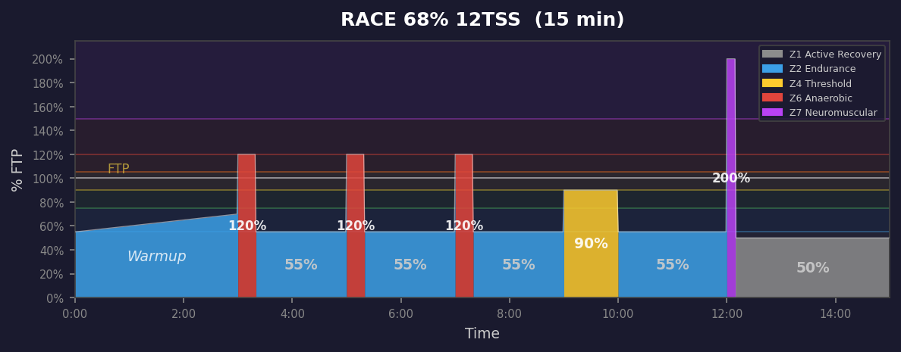
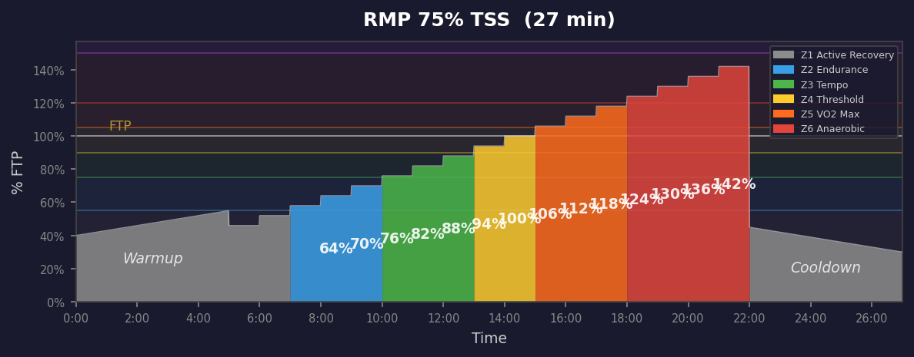
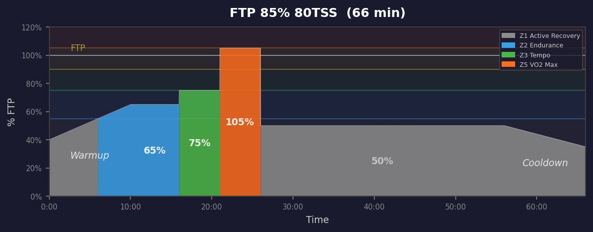

# Special Workouts

**3 workouts** — power profile graphs below.

| Duration | IF | TSS | Description |
|:--------:|:--:|:---:|:------------|
| 15m | 0% | 0 | 15min pre-race warmup. 3 openers + threshold check + sprint snap. You'll be acti |
| 25m | 0% | 0 | 25min ramp FTP test. 1-min steps from 46% to failure. FTP = 75% of last complete |
| 65m | 0% | 0 | 65min standard Coggan 20-min FTP test. Includes 5-min blowout to flush anaerobic |

---

## Power Profiles

### Race Warmup 68% 12TSS

### Ramp Test 75% pointed TSS

### FTP Test 85% 80TSS

