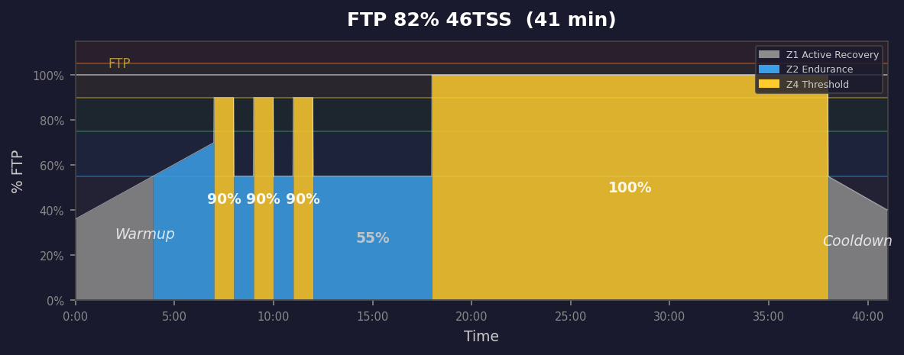

# Special Workouts

**2 workouts** — power profile graphs below.

| Duration | IF | TSS | Description |
|:--------:|:--:|:---:|:------------|
| 15m | 0% | 0 | 15min pre-race warmup. 3 openers + threshold check + sprint snap. You'll be acti |
| 50m | 0% | 0 | 50min FTP test protocol. 20min max effort. Multiply avg power by 0.95 for new FT |

---

## Power Profiles

### Race Warmup 68% 12TSS

### FTP Test 82% 46TSS

