# Sweet Spot Workouts

**11 workouts** — power profile graphs below.

| Duration | IF | TSS | Description |
|:--------:|:--:|:---:|:------------|
| 20m | 76% | 24 | 20min | 1x30s attacks + 1x60s sustained + 1x8min sweet spot @ 89%. |
| 30m | 76% | 30 | 30min | 2x30s attacks + 1x60s sustained + 1x8min sweet spot @ 89%. |
| 45m | 73% | 40 | 45min | 2x30s attacks + 2x60s sustained + 1x8min sweet spot @ 89%. |
| 60m | 79% | 62 | 60min | 3x30s attacks + 3x60s sustained + 2x10min sweet spot @ 88%. |
| 75m | 76% | 72 | 75min | 4x30s attacks + 3x60s sustained + 2x10min sweet spot @ 88%. |
| 90m | 76% | 88 | 90min | 5x30s attacks + 4x60s sustained + 2x12min sweet spot @ 87%. |
| 105m | 77% | 105 | 105min | 5x30s attacks + 4x60s sustained + 3x12min sweet spot @ 87%. |
| 120m | 78% | 121 | 120min | 5x30s attacks + 4x60s sustained + 4x12min sweet spot @ 87%. |
| 150m | 78% | 153 | 150min | 5x30s attacks + 4x60s sustained + 6x12min sweet spot @ 86%. |
| 160m | 77% | 159 | 160min | 5x30s attacks + 4x60s sustained + 6x12min sweet spot @ 86%. |
| 180m | 75% | 168 | 180min | 5x30s attacks + 4x60s sustained + 6x12min sweet spot @ 85%. |

---

## Power Profiles

### SS 76% 24TSS

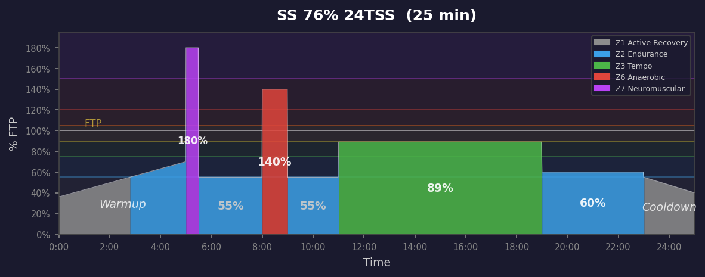

### SS 76% 30TSS

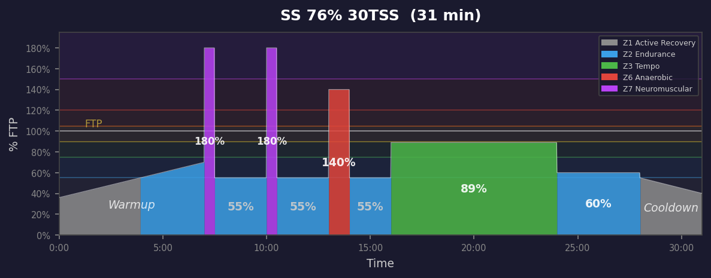

### SS 73% 40TSS

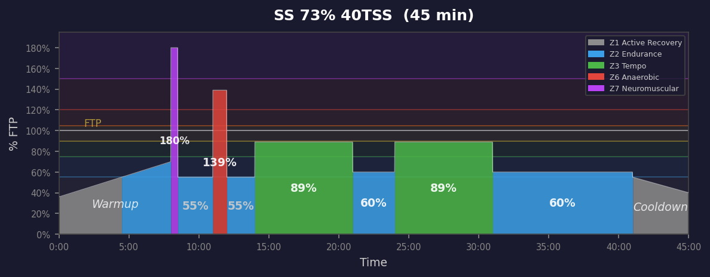

### SS 79% 62TSS

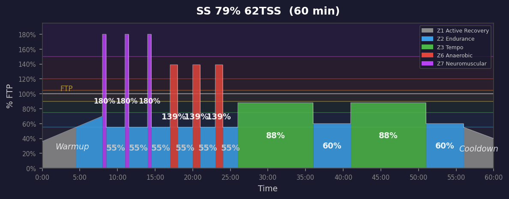

### SS 76% 72TSS

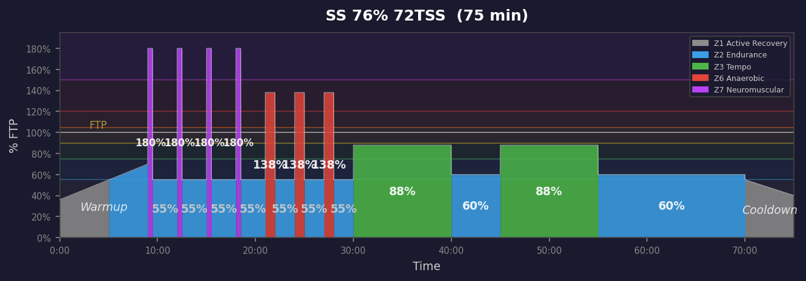

### SS 76% 88TSS

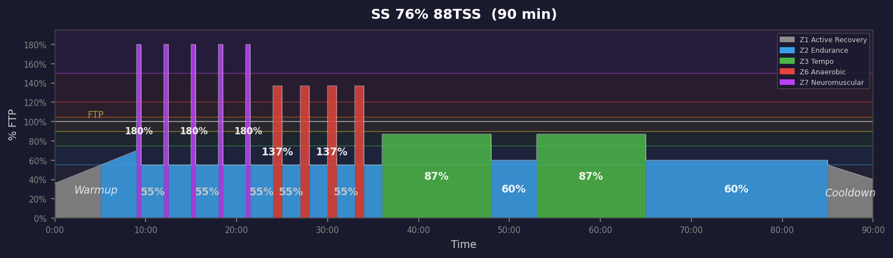

### SS 77% 105TSS

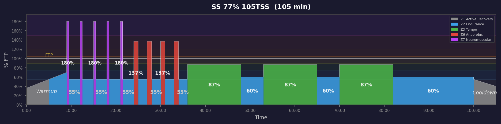

### SS 78% 121TSS

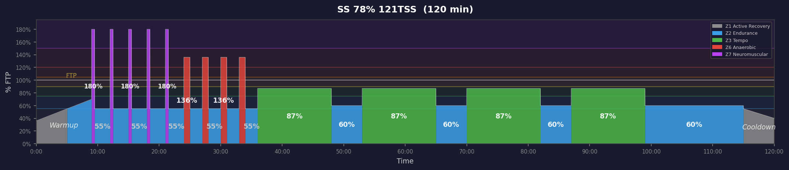

### SS 78% 153TSS

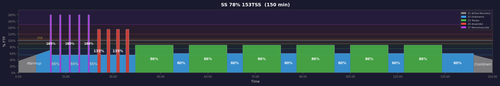

### SS 77% 159TSS

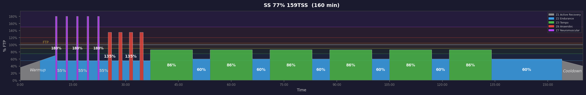

### SS 75% 168TSS

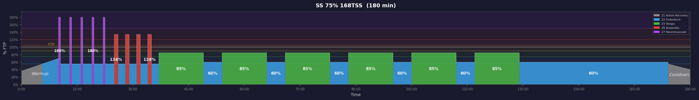

