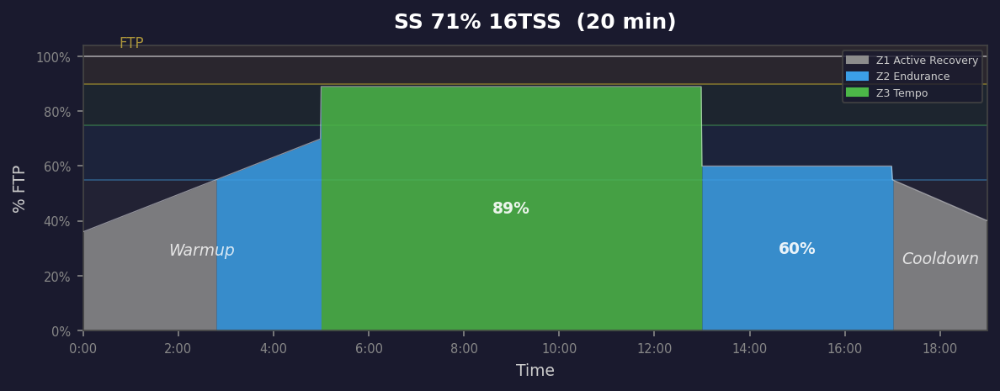
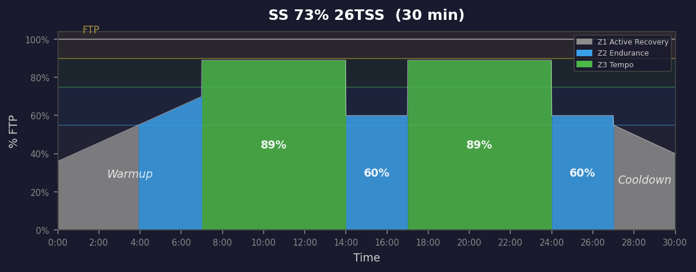
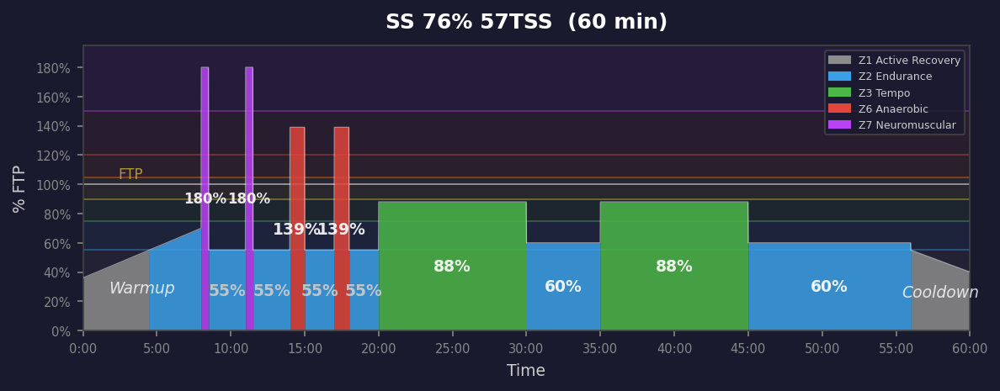

# Sweet Spot Workouts

**10 workouts** — power profile graphs below.

| Duration | IF | TSS | Description |
|:--------:|:--:|:---:|:------------|
| 20m | 71% | 16 | 20min | 1x8min sweet spot @ 89% (RPE 7). |
| 30m | 73% | 26 | 30min | 2x7min sweet spot @ 89% (RPE 7). |
| 45m | 73% | 40 | 45min | 1x30s + 1x60s attacks + 2x7min sweet spot @ 89% (RPE 7). |
| 60m | 76% | 57 | 60min | 2x30s + 2x60s attacks + 2x10min sweet spot @ 88% (RPE 7). |
| 75m | 76% | 72 | 75min | 4x30s + 3x60s attacks + 2x10min sweet spot @ 88% (RPE 7). |
| 90m | 76% | 88 | 90min | 5x30s + 4x60s attacks + 2x12min sweet spot @ 87% (RPE 7). |
| 105m | 77% | 105 | 105min | 5x30s + 4x60s attacks + 3x12min sweet spot @ 87% (RPE 7). |
| 120m | 78% | 121 | 120min | 5x30s + 4x60s attacks + 4x12min sweet spot @ 87% (RPE 7). |
| 150m | 78% | 153 | 150min | 5x30s + 4x60s attacks + 6x12min sweet spot @ 86% (RPE 7). |
| 180m | 75% | 168 | 180min | 5x30s + 4x60s attacks + 6x12min sweet spot @ 85% (RPE 7). |

---

## Power Profiles

### 020m SweetSpot 71% 16TSS

### 030m SweetSpot 73% 26TSS

### 045m SweetSpot 73% 40TSS

### 060m SweetSpot 76% 57TSS

### 075m SweetSpot 76% 72TSS

### 090m SweetSpot 76% 88TSS

### 105m SweetSpot 77% 105TSS

### 120m SweetSpot 78% 121TSS

### 150m SweetSpot 78% 153TSS

### 180m SweetSpot 75% 168TSS

