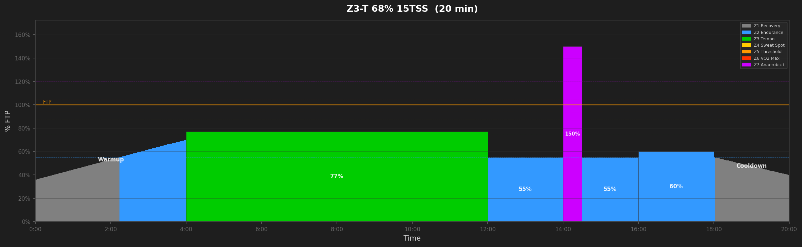
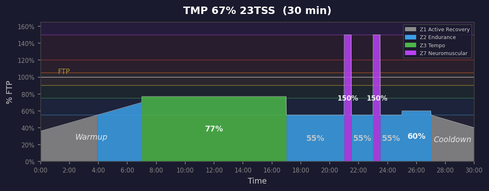
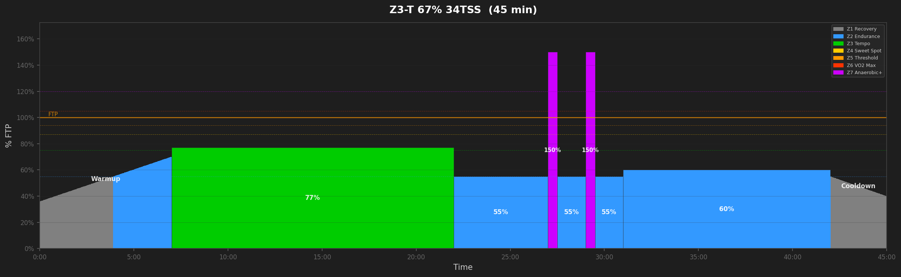
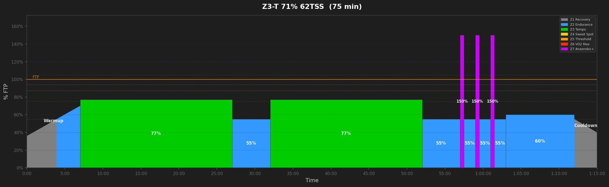
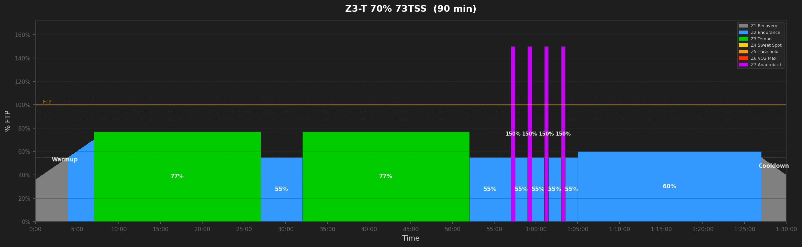
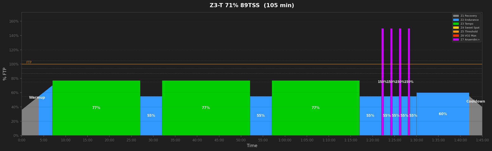
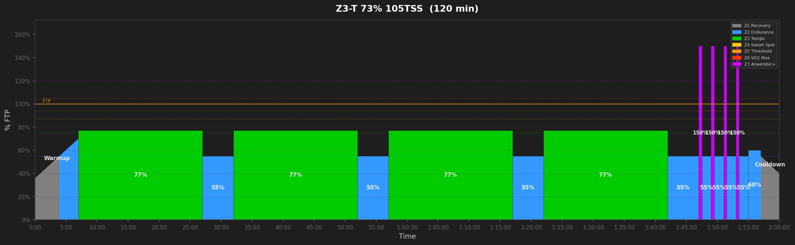

# Tempo Workouts

## Z3-T 68% 15TSS  (20 min)

_20min tempo with 1x30s race surge. Builds pacing and 30s attack confidence._

---

## Z3-T 67% 23TSS  (30 min)

_30min tempo with 2x30s race surges. Builds pacing and 30s attack confidence from pace._

---

## Z3-T 67% 34TSS  (45 min)

_45min tempo with 2x30s race surges. Builds pacing and 30s attack confidence from pace._

---

## Z3-T 70% 49TSS  (60 min)

_60min tempo with 3x30s race surges. Builds pacing and 30s attack confidence from pace._

---

## Z3-T 71% 62TSS  (75 min)

_75min tempo with 3x30s race surges. Builds pacing and 30s attack confidence from pace._

---

## Z3-T 70% 73TSS  (90 min)

_90min tempo with 4x30s race surges. Builds pacing and 30s attack confidence from pace._

---

## Z3-T 71% 89TSS  (105 min)

_105min tempo with 4x30s race surges. Builds pacing and 30s attack confidence from pace._

---

## Z3-T 73% 105TSS  (120 min)

_120min tempo with 4x30s race surges. Builds pacing and 30s attack confidence from pace._

---
