# Tempo Workouts

**16 workouts** — power profile graphs below.

| Duration | IF | TSS | Description |
|:--------:|:--:|:---:|:------------|
| 20m | 70% | 20 | 20min tempo @ 77% with 2x30s surges. Builds pacing and 30s attack confidence fro |
| 30m | 67% | 23 | 30min tempo @ 77% with 2x30s surges. Builds pacing and 30s attack confidence fro |
| 45m | 66% | 33 | 45min tempo @ 77% with 3x30s surges. Builds pacing and 30s attack confidence fro |
| 60m | 69% | 48 | 60min tempo @ 76% with 3x30s surges. Builds pacing and 30s attack confidence fro |
| 75m | 70% | 62 | 75min tempo @ 76% with 4x30s surges. Builds pacing and 30s attack confidence fro |
| 90m | 69% | 71 | 90min tempo @ 76% with 4x30s surges. Builds pacing and 30s attack confidence fro |
| 105m | 70% | 87 | 105min tempo @ 75% with 5x30s surges. Builds pacing and 30s attack confidence fr |
| 120m | 69% | 96 | 120min tempo @ 75% with 5x30s surges. Builds pacing and 30s attack confidence fr |
| 150m | 69% | 118 | 150min tempo @ 74% with 5x30s surges. Builds pacing and 30s attack confidence fr |
| 160m | 70% | 129 | 160min tempo @ 74% with 5x30s surges. Builds pacing and 30s attack confidence fr |
| 180m | 70% | 147 | 180min tempo @ 74% with 5x30s surges. Builds pacing and 30s attack confidence fr |
| 200m | 68% | 155 | 200min tempo @ 73% with 5x30s surges. Builds pacing and 30s attack confidence fr |
| 220m | 68% | 167 | 220min tempo @ 73% with 5x30s surges. Builds pacing and 30s attack confidence fr |
| 240m | 66% | 177 | 240min tempo @ 72% with 5x30s surges. Builds pacing and 30s attack confidence fr |
| 270m | 65% | 191 | 270min tempo @ 71% with 5x30s surges. Builds pacing and 30s attack confidence fr |
| 300m | 65% | 209 | 300min tempo @ 71% with 5x30s surges. Builds pacing and 30s attack confidence fr |

---

## Power Profiles

### Z3-T 70% 20TSS

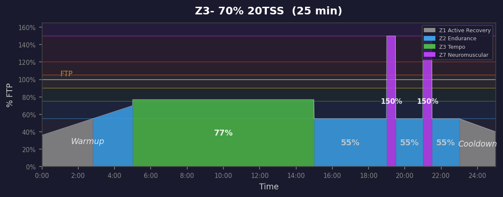

### Z3-T 67% 23TSS

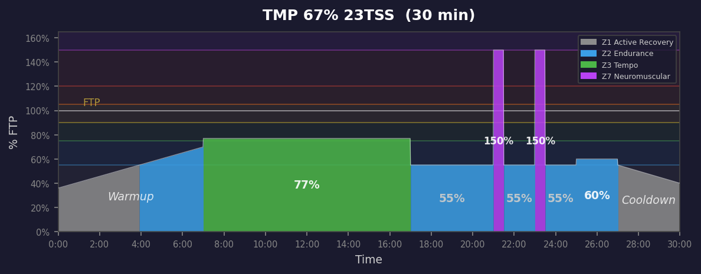

### Z3-T 66% 33TSS

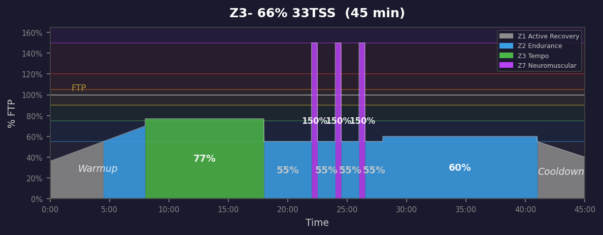

### Z3-T 69% 48TSS

### Z3-T 70% 62TSS

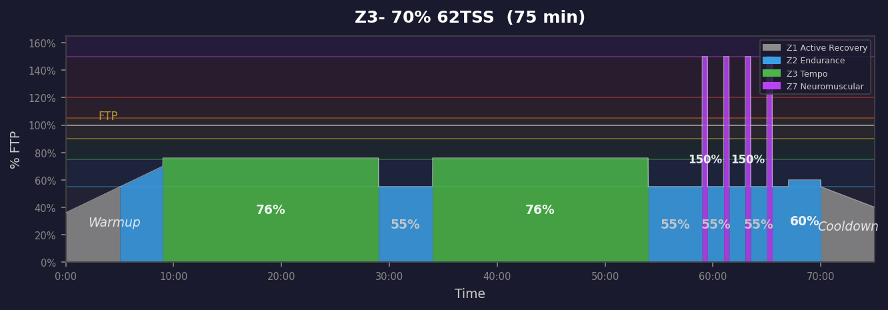

### Z3-T 69% 71TSS

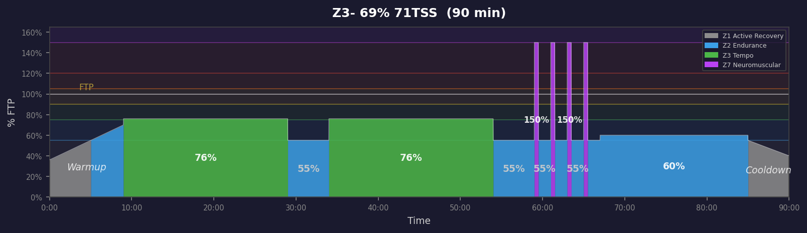

### Z3-T 70% 87TSS

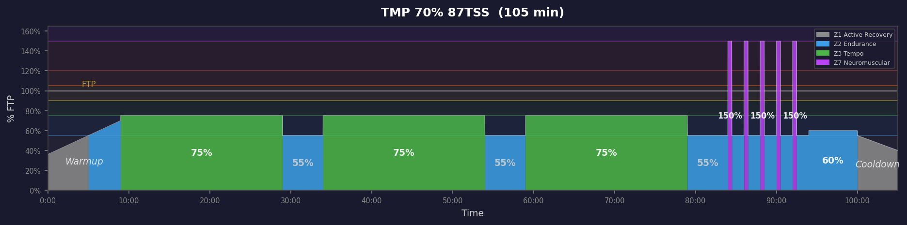

### Z3-T 69% 96TSS

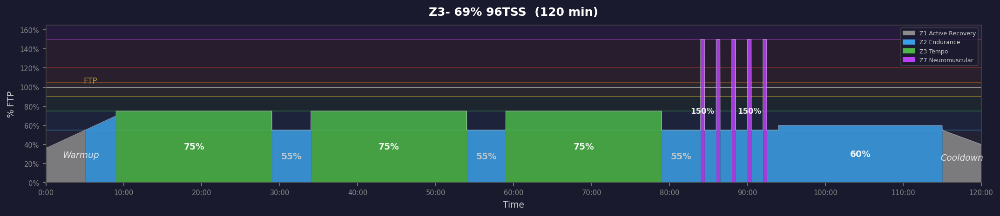

### Z3-T 69% 118TSS

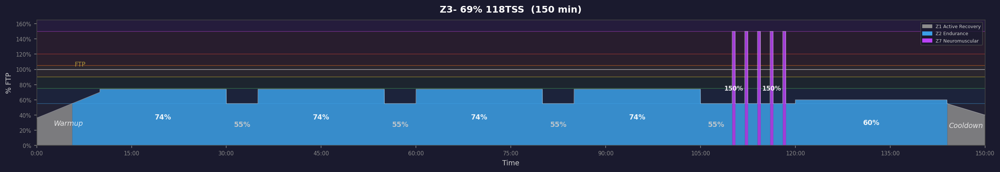

### Z3-T 70% 129TSS

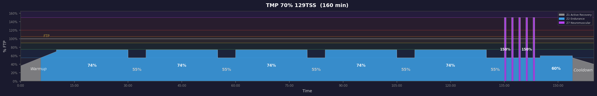

### Z3-T 70% 147TSS

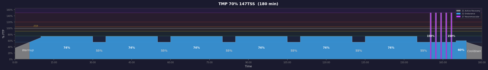

### Z3-T 68% 155TSS

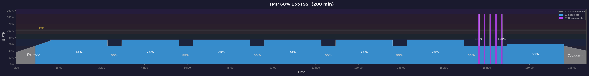

### Z3-T 68% 167TSS

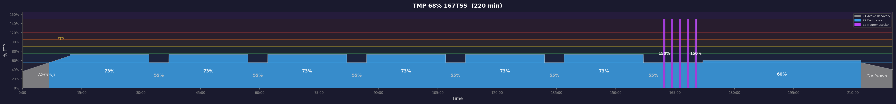

### Z3-T 66% 177TSS

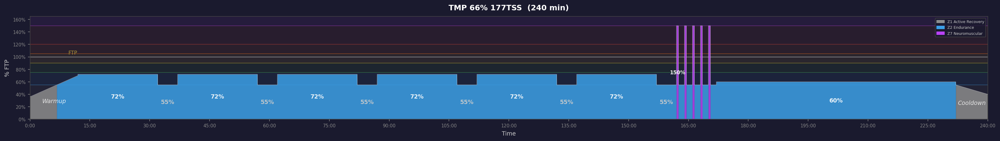

### Z3-T 65% 191TSS

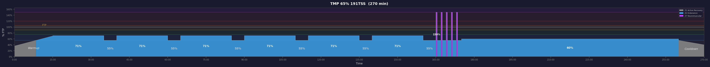

### Z3-T 65% 209TSS

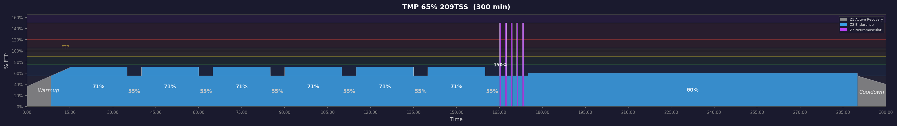

