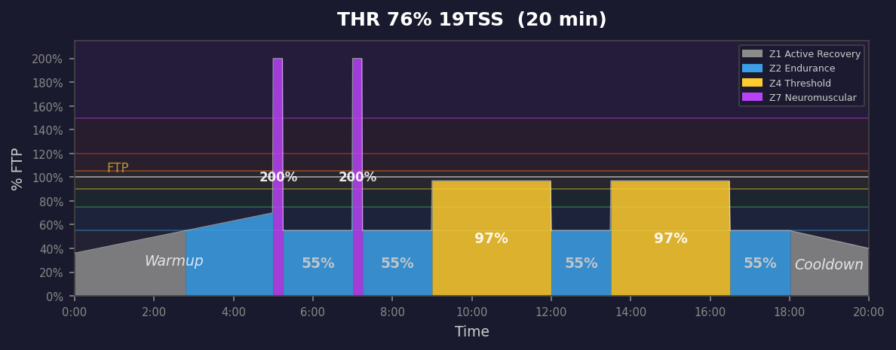
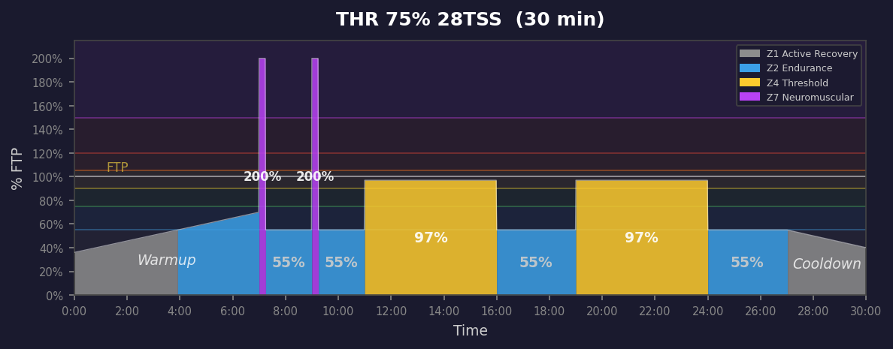
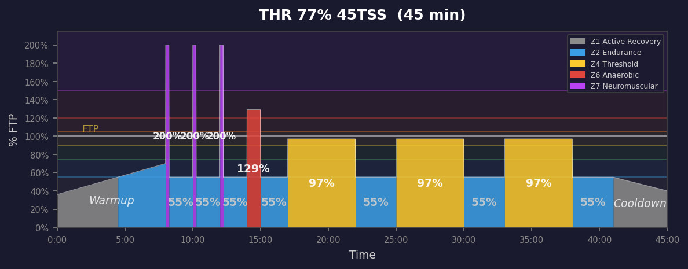
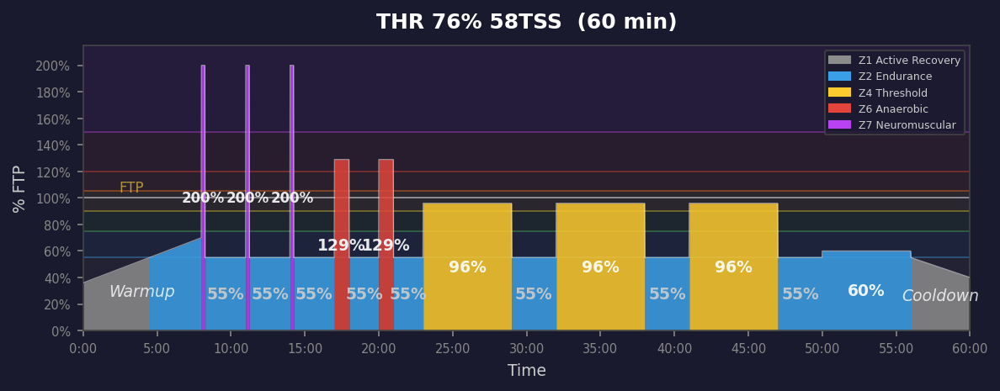
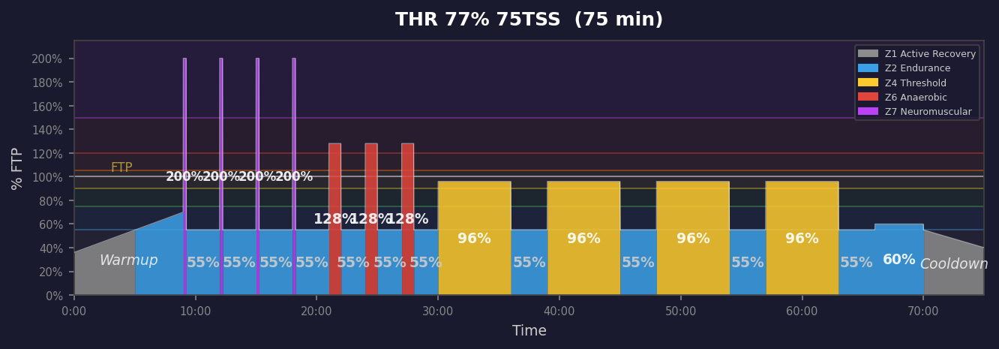
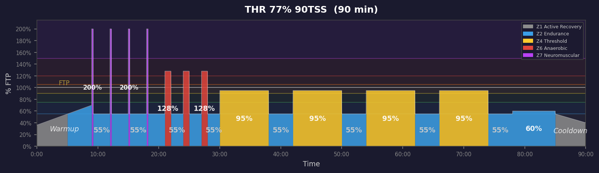
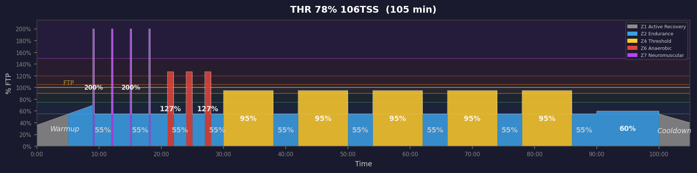
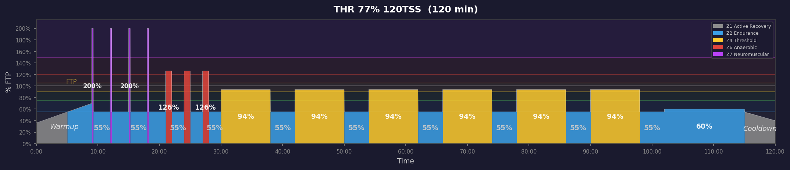

# Threshold Workouts

**8 workouts** — power profile graphs below.

| Duration | IF | TSS | Description |
|:--------:|:--:|:---:|:------------|
| 20m | 76% | 19 | 20min | 2x15s sprints + 0x60s attacks + 2x3min threshold @ 97%. Intensity scales |
| 30m | 75% | 28 | 30min | 2x15s sprints + 0x60s attacks + 2x5min threshold @ 97%. Intensity scales |
| 45m | 77% | 45 | 45min | 3x15s sprints + 1x60s attacks + 3x5min threshold @ 97%. Intensity scales |
| 60m | 76% | 58 | 60min | 3x15s sprints + 2x60s attacks + 3x6min threshold @ 96%. Intensity scales |
| 75m | 77% | 75 | 75min | 4x15s sprints + 3x60s attacks + 4x6min threshold @ 96%. Intensity scales |
| 90m | 77% | 90 | 90min | 4x15s sprints + 3x60s attacks + 4x8min threshold @ 95%. Intensity scales |
| 105m | 78% | 106 | 105min | 4x15s sprints + 3x60s attacks + 5x8min threshold @ 95%. Intensity scale |
| 120m | 77% | 120 | 120min | 4x15s sprints + 3x60s attacks + 6x8min threshold @ 94%. Intensity scale |

---

## Power Profiles

### 020m Threshold 76% 19TSS

### 030m Threshold 75% 28TSS

### 045m Threshold 77% 45TSS

### 060m Threshold 76% 58TSS

### 075m Threshold 77% 75TSS

### 090m Threshold 77% 90TSS

### 105m Threshold 78% 106TSS

### 120m Threshold 77% 120TSS

