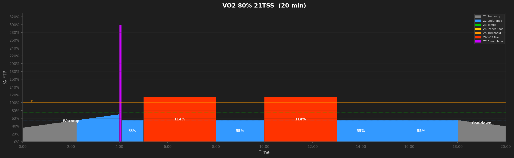
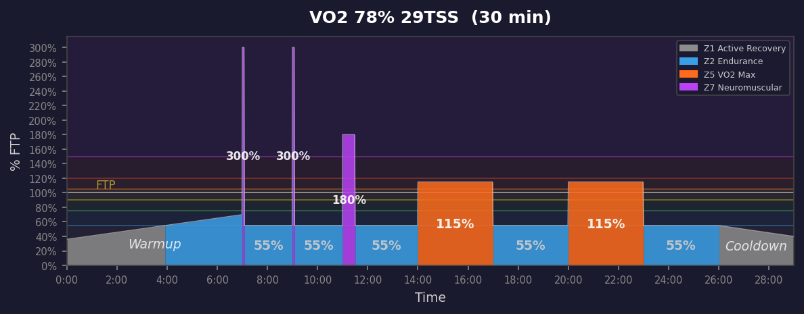
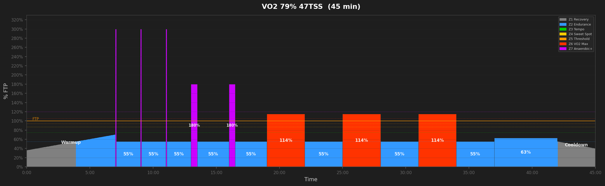
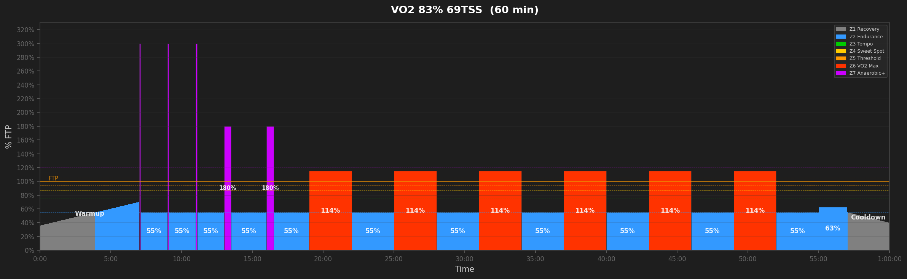
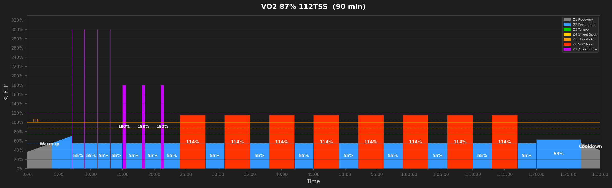
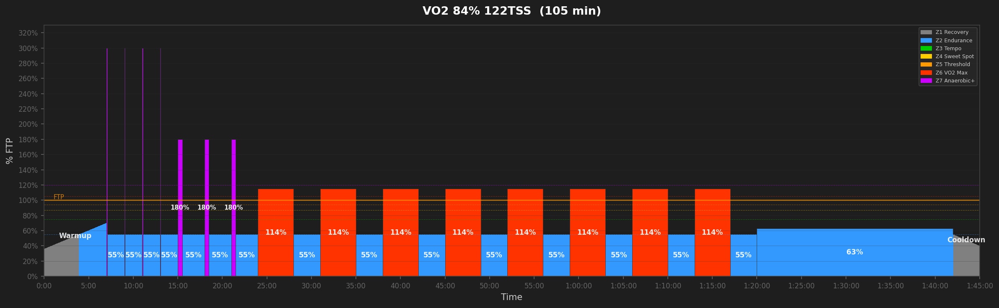
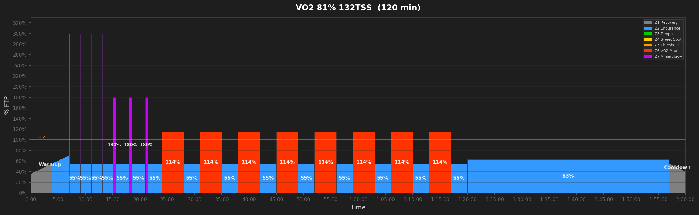

# VO2 Max Workouts

## VO2 80% 21TSS  (20 min)

_20min | 1x5s max snap + 2x3min VO2 Max intervals. Targets 5s peak power and aerobic ceiling._

---

## VO2 78% 29TSS  (29 min)

_30min | 2x5s max snaps + 1x30s attack bursts + VO2 Max intervals. Targets 5s peak power, 30s attack, and aerobic ceiling._

---

## VO2 79% 47TSS  (45 min)

_45min | 3x5s max snaps + 2x30s attack bursts + VO2 Max intervals. Targets 5s peak power, 30s attack, and aerobic ceiling._

---

## VO2 83% 69TSS  (60 min)

_60min | 3x5s max snaps + 2x30s attack bursts + VO2 Max intervals. Targets 5s peak power, 30s attack, and aerobic ceiling._

---

## VO2 85% 91TSS  (75 min)

_75min | 4x5s max snaps + 3x30s attack bursts + VO2 Max intervals. Targets 5s peak power, 30s attack, and aerobic ceiling._

---

## VO2 87% 112TSS  (90 min)

_90min | 4x5s max snaps + 3x30s attack bursts + VO2 Max intervals. Targets 5s peak power, 30s attack, and aerobic ceiling._

---

## VO2 84% 122TSS  (105 min)

_105min | 4x5s max snaps + 3x30s attack bursts + VO2 Max intervals. Targets 5s peak power, 30s attack, and aerobic ceiling._

---

## VO2 81% 132TSS  (120 min)

_120min | 4x5s max snaps + 3x30s attack bursts + VO2 Max intervals. Targets 5s peak power, 30s attack, and aerobic ceiling._

---
