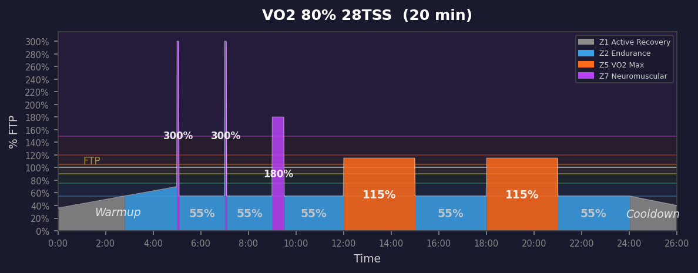
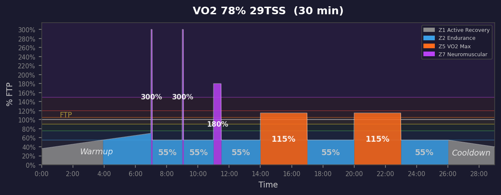
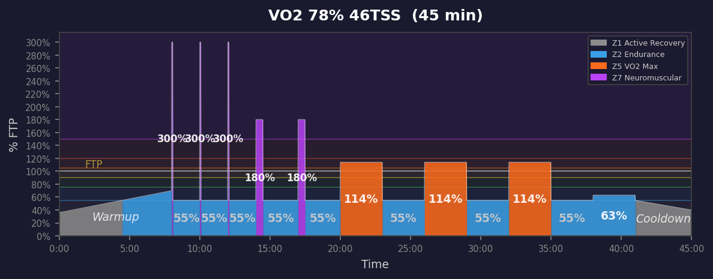
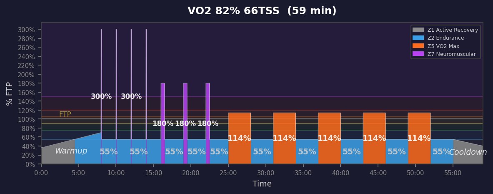
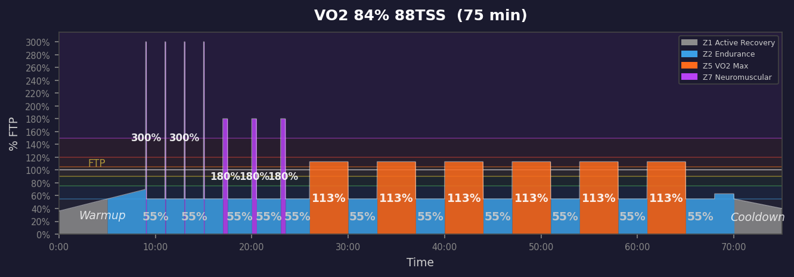
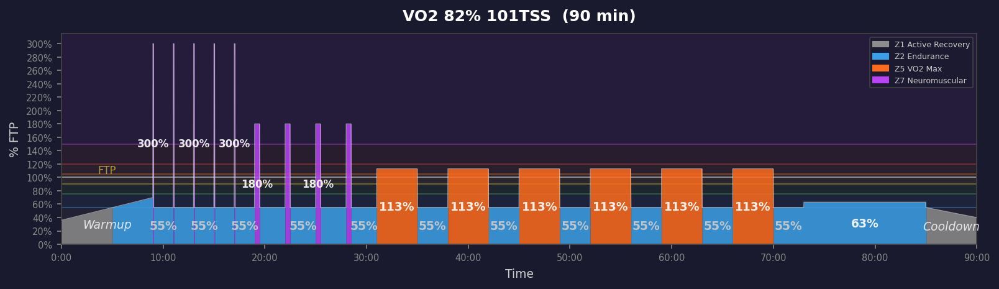

# VO2 Max Workouts

**6 workouts** — power profile graphs below.

| Duration | IF | TSS | Description |
|:--------:|:--:|:---:|:------------|
| 20m | 80% | 28 | 20min | 2x5s max snaps + 1x30s attack bursts + 2x3min VO2 Max @ 114%. |
| 30m | 78% | 29 | 30min | 2x5s max snaps + 1x30s attack bursts + 2x3min VO2 Max @ 114%. |
| 45m | 78% | 46 | 45min | 3x5s max snaps + 2x30s attack bursts + 3x3min VO2 Max @ 113%. |
| 60m | 82% | 66 | 60min | 4x5s max snaps + 3x30s attack bursts + 5x3min VO2 Max @ 113%. |
| 75m | 84% | 88 | 75min | 4x5s max snaps + 3x30s attack bursts + 6x4min VO2 Max @ 112%. |
| 90m | 82% | 101 | 90min | 5x5s max snaps + 4x30s attack bursts + 6x4min VO2 Max @ 112%. |

---

## Power Profiles

### 020m VO2Max 80% 28TSS

### 030m VO2Max 78% 29TSS

### 045m VO2Max 78% 46TSS

### 060m VO2Max 82% 66TSS

### 075m VO2Max 84% 88TSS

### 090m VO2Max 82% 101TSS

