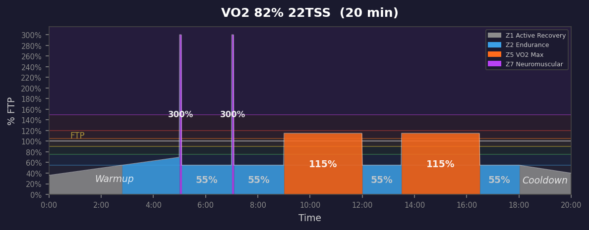
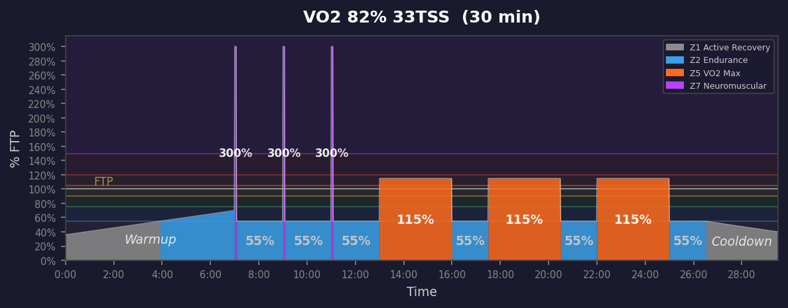
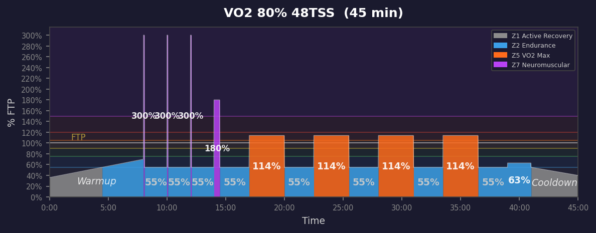
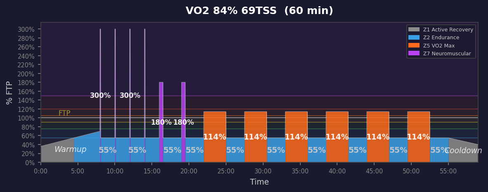
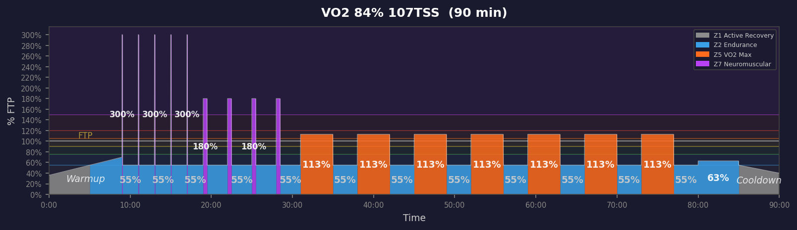

# VO2 Max Workouts

**6 workouts** — power profile graphs below.

| Duration | IF | TSS | Description |
|:--------:|:--:|:---:|:------------|
| 20m | 82% | 22 | 20min | 2x5s max snaps + 2x3min VO2 Max @ 114% (RPE 9). Short = denser, long = m |
| 30m | 82% | 33 | 30min | 3x5s max snaps + 3x3min VO2 Max @ 114% (RPE 9). Short = denser, long = m |
| 45m | 80% | 48 | 45min | 3x5s max snaps + 1x30s attacks + 4x3min VO2 Max @ 113% (RPE 9). Short =  |
| 60m | 84% | 69 | 60min | 4x5s max snaps + 2x30s attacks + 6x3min VO2 Max @ 113% (RPE 9). Short =  |
| 75m | 84% | 88 | 75min | 4x5s max snaps + 3x30s attacks + 6x4min VO2 Max @ 112% (RPE 9). Short =  |
| 90m | 84% | 107 | 90min | 5x5s max snaps + 4x30s attacks + 7x4min VO2 Max @ 112% (RPE 9). Short =  |

---

## Power Profiles

### 020m VO2Max 82% 22TSS

### 030m VO2Max 82% 33TSS

### 045m VO2Max 80% 48TSS

### 060m VO2Max 84% 69TSS

### 075m VO2Max 84% 88TSS

### 090m VO2Max 84% 107TSS

