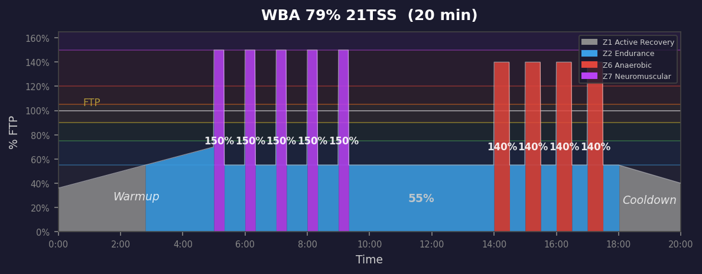
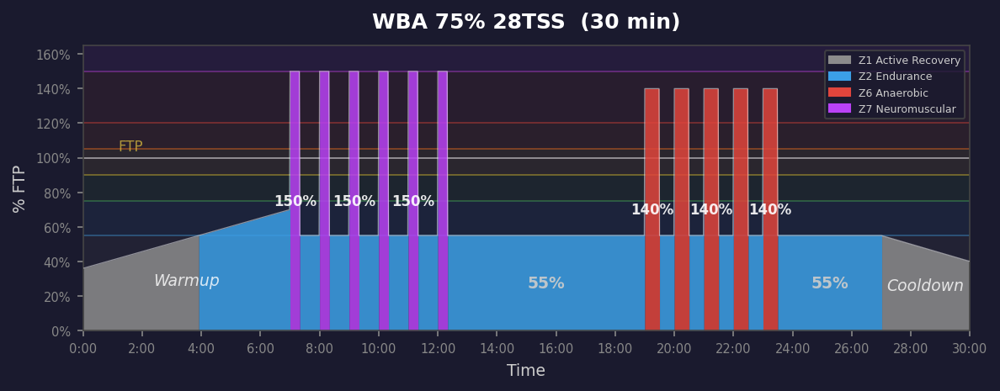
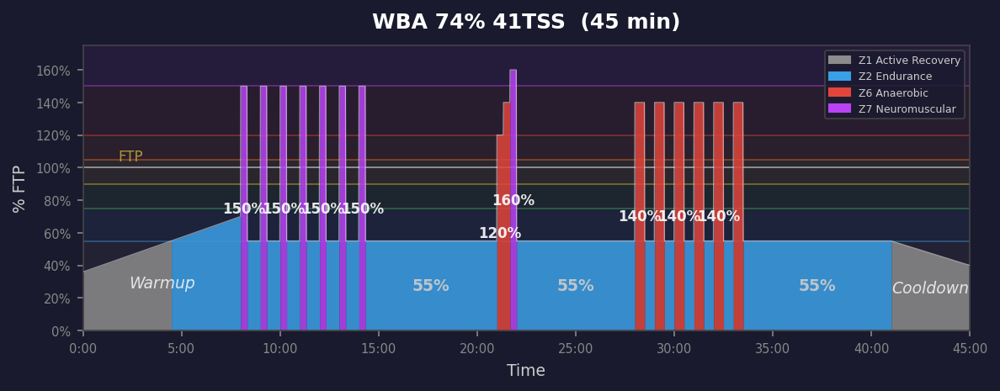
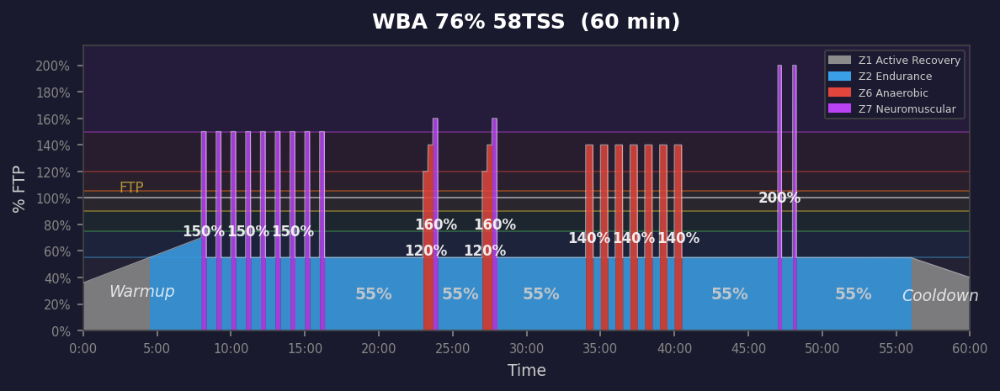
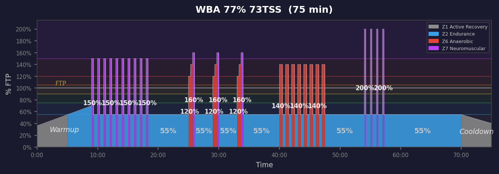

# Wbal Workouts

**5 workouts** — power profile graphs below.

| Duration | IF | TSS | Description |
|:--------:|:--:|:---:|:------------|
| 20m | 79% | 21 | 20min W'bal depletion: 5x(20s@150%/40s) + 4x(30s@140%/30s). Incomplete recovery  |
| 30m | 75% | 28 | 30min W'bal depletion: 6x(20s@150%/40s) + 5x(30s@140%/30s). Incomplete recovery  |
| 45m | 74% | 41 | 45min W'bal depletion: 7x(20s@150%/40s) + 1x staircase(120->160%) + 6x(30s@140%/ |
| 60m | 76% | 58 | 60min W'bal depletion: 9x(20s@150%/40s) + 2x staircase(120->160%) + 7x(30s@140%/ |
| 75m | 77% | 73 | 75min W'bal depletion: 10x(20s@150%/40s) + 3x staircase(120->160%) + 8x(30s@140% |

---

## Power Profiles

### 020m Wbal 79% 21TSS

### 030m Wbal 75% 28TSS

### 045m Wbal 74% 41TSS

### 060m Wbal 76% 58TSS

### 075m Wbal 77% 73TSS

